# ZRT CosmicFlows-4 Research Workbench: Mathematical Monograph & Visual Cosmography Atlas

[](https://cf4-five.vercel.app)
[](CosmicFlows4.apk)
[](LICENSE)
[](tests/)
[](src/)
[](src/export/)

---

## Table of Contents

1. [Executive Summary & Architectural Scope](#1-executive-summary--architectural-scope)
2. [Fundamental Cosmological Invariants & Axiomatic Principles](#2-fundamental-cosmological-invariants--axiomatic-principles)
3. [Mathematical Foundations & First-Principles Derivations](#3-mathematical-foundations--first-principles-derivations)
   - 3.1 [Velocity Gradient, Symmetric Strain Rate, Vorticity & Okubo-Weiss Invariants](#31-velocity-gradient-symmetric-strain-rate-vorticity--okubo-weiss-invariants)
   - 3.2 [Gravitational Tidal Tensors, Web Classification & Exact Zel'dovich Collapse](#32-gravitational-tidal-tensors-web-classification--exact-zeldovich-collapse)
   - 3.3 [Tidal Torque Theory (TTT) Protogalactic Angular Momentum Generation](#33-tidal-torque-theory-ttt-protogalactic-angular-momentum-generation)
   - 3.4 [3D Velocity Dispersion Tensors, Anisotropy & Spherical Jeans Mass Inversion](#34-3d-velocity-dispersion-tensors-anisotropy--spherical-jeans-mass-inversion)
   - 3.5 [Exact Analytical Solutions for Dark Matter Haloes (SIS, Hernquist, NFW)](#35-exact-analytical-solutions-for-dark-matter-haloes-sis-hernquist-nfw)
   - 3.6 [Helmholtz-Hodge Spectral Vector Decomposition & Parseval L2 Orthogonality](#36-helmholtz-hodge-spectral-vector-decomposition--parseval-l2-orthogonality)
   - 3.7 [Dynamical Topology, 3D Newton-Raphson Roots & Morse-Smale Complexes](#37-dynamical-topology-3d-newton-raphson-roots--morse-smale-complexes)
   - 3.8 [Persistent Homology, 3D Cubical Complexes & Betti Curves](#38-persistent-homology-3d-cubical-complexes--betti-curves)
   - 3.9 [Tomita-Gott Gaussian Random Field Analytical Euler Morphometry & Asymmetry](#39-tomita-gott-gaussian-random-field-analytical-euler-morphometry--asymmetry)
   - 3.10 [Multipolar Bulk Flow Estimators & Cosmic Variance Covariance](#310-multipolar-bulk-flow-estimators--cosmic-variance-covariance)
   - 3.11 [Multi-Band Tully-Fisher Extragalactic Calibrations & Malmquist Corrections](#311-multi-band-tully-fisher-extragalactic-calibrations--malmquist-corrections)
   - 3.12 [Bayesian Hamiltonian Monte Carlo (HMC) & Symplectic Leapfrog Sampling](#312-bayesian-hamiltonian-monte-carlo-hmc--symplectic-leapfrog-sampling)
   - 3.13 [Ledoit-Wolf & OAS Optimal Linear Covariance Shrinkage Estimators](#313-ledoit-wolf--oas-optimal-linear-covariance-shrinkage-estimators)
   - 3.14 [MCMC Convergence Diagnostics: Gelman-Rubin R-hat, ESS Suite & Geweke Scores](#314-mcmc-convergence-diagnostics-gelman-rubin-r-hat-ess-suite--geweke-scores)
   - 3.15 [Exact Simplicial Marching Tetrahedra & Hydrodynamic Flux Integrals](#315-exact-simplicial-marching-tetrahedra--hydrodynamic-flux-integrals)
4. [52-Screenshot Visual Cosmography Atlas & Landmark Catalogue](#4-52-screenshot-visual-cosmography-atlas--landmark-catalogue)
   - 4.1 [Tier 1: Major Superclusters & Convergence Basins (01–10)](#41-tier-1-major-superclusters--convergence-basins-0110)
   - 4.2 [Tier 2: Key Named Galaxy Clusters & Halos (11–26)](#42-tier-2-key-named-galaxy-clusters--halos-1126)
   - 4.3 [Scientific Reconstruction Engines (27–33)](#43-scientific-reconstruction-engines-2733)
   - 4.4 [Cosmological Time Evolution Epochs (34–38)](#44-cosmological-time-evolution-epochs-3438)
   - 4.5 [High-Resolution Spectroscopic Dossiers (39–44)](#45-high-resolution-spectroscopic-dossiers-3944)
   - 4.6 [2D Planar Slices, Watershed Envelopes & Mobile UX (45–52)](#46-2d-planar-slices-watershed-envelopes--mobile-ux-4552)
5. [Automated Verification & Test Proof Suite (1,032 Passing Tests)](#5-automated-verification--test-proof-suite-1032-passing-tests)
6. [Data Ingestion, HTTP Range Streaming & IndexedDB Binary Caching](#6-data-ingestion-http-range-streaming--indexeddb-binary-caching)
7. [Software Architecture & Subsystem Taxonomy (87,516 LOC)](#7-software-architecture--subsystem-taxonomy-87516-loc)
8. [Scientific Provenance, Cryptographic Hashing & W3C PROV-JSONLD](#8-scientific-provenance-cryptographic-hashing--w3c-prov-jsonld)
9. [Comprehensive Publications Catalogue & Citations Directory (15+ Pages)](#9-comprehensive-publications-catalogue--citations-directory-15-pages)
10. [Author Credits, Professional Ecosystem & License](#10-author-credits-professional-ecosystem--license)

---

## 1. Executive Summary & Architectural Scope

The **ZRT CosmicFlows-4 Research Workbench** is an industrial-scale, mathematically rigorous computational cosmography and astrophysical research platform. It was engineered from first principles to address the grand challenge of three-dimensional reconstruction, dynamical classification, phase-space streamline integration, and statistical uncertainty propagation in the local cosmological volume ($z \le 0.08$, corresponding to a comoving box radius of $500\,h^{-1}\text{Mpc}$).

### Key Pillars & Scientific Deliverables:
- **87,516 Meaningful Non-HTML LOC**: Across 207 verified modular files written in ES6 JavaScript and Python, strictly audited without HTML/CSS/comment inflation.
- **1,032 Automated Tests (100% Pass Rate)**: Covering mathematical invariants, continuous derivatives, convergence limits, phase-space conservation, and Chrome/Edge DevTools Protocol (CDP) WebGL rendering.
- **Full 3D Resolution Support**: Progressive HTTP Range-Request streaming for $64^3$, $128^3$, and $256^3$ FITS arrays directly from IP2I Lyon and CDS Strasbourg archives.
- **Zero-Copy Web Worker Concurrency**: Off-thread Big-Endian binary decoding and tensor computations paired with Transferable ArrayBuffers to maintain sustained 60 FPS in Three.js WebGL.
- **W3C PROV-JSONLD Compliance**: End-to-end cryptographic provenance auditing every execution step with SHA-256 hashes and automated LaTeX figure captions.

---


## 1.1 Project Inception & Step-by-Step Chronological Evolution

The development of the **ZRT CosmicFlows-4 Research Workbench** represents an end-to-end engineering journey spanning mathematical physics, observational extragalactic astrophysics, GPU-accelerated WebGL visualization, distributed Web Worker multithreading, and automated scientific verification. Below is the complete step-by-step record of how this platform was built from first principles:

### Step 1: Scientific Invariants & Axiomatic Foundation
- Formulated the **9 Cosmological Invariant Principles** documented in [`AGENTS.md`](AGENTS.md) and [`GEMINI.md`](GEMINI.md).
- Enforced strict 7-base physical dimension tensor checking (`[L, M, T, I, Theta, N, J]`), guaranteeing that incompatible dimensional arithmetic (e.g. combining spatial coordinates in $\text{Mpc}/h$ directly with peculiar velocities in $\text{km}/\text{s}$) fails loudly with an explicit runtime `TypeError`.
- Locked in the canonical coordinate transformation mapping official CosmicFlows Fortran row-major slice storage $(\text{SGZ}, \text{SGY}, \text{SGX})$ into the canonical ZRT Cartesian representation $(\text{SGX}, \text{SGY}, \text{SGZ})$ with exact 1D stride indexing: $\text{index}(i_x, i_y, i_z) = i_x + N_x \cdot (i_y + N_y \cdot i_z)$.
- Validated the official Cosmicflows project velocity scaling factor of **exactly $\times 52.0$**, ensuring physical peculiar velocity units ($\text{km}/\text{s}$) are decoupled from cosmological growth rate parameters ($H_0 f$) and applied strictly once.

### Step 2: 87,516 LOC Modular Subsystem Architecture
- Constructed an industrial-scale codebase across 17 dedicated subsystems in `src/`:
  1. `src/fields/`: Symmetric rate-of-strain tensors $S_{ij}$, antisymmetric vorticity $\Omega_{ij}$, Okubo-Weiss vortex criteria $Q = s^2 - \omega^2$, trace-free gravitational tidal tensors $T_{ij}$, velocity dispersion tensors $\sigma_{ij}^2$, and 3D spectral Helmholtz-Hodge vector field decompositions.
  2. `src/topology/`: Multidimensional 3D Newton-Raphson stationary point isolators, Morse-Smale complex topological cells, 3D cubical complexes, $\mathbb{Z}_2$ persistent homology nilpotency $\partial \circ \partial = 0$, Betti curves ($\beta_0, \beta_1, \beta_2$), and Tomita-Gott Euler characteristic density $V_3(\nu)$.
  3. `src/bulk-flow/`: Maximum-likelihood dipole estimators, spherical harmonic multipole series $u(r, \theta, \phi) = \sum a_{\ell m} Y_{\ell m}$, quadrupole cosmic shear tensors $Q_{jk}$, and top-hat cosmic variance covariance matrices $R_{ij}(R)$.
  4. `src/data/`: Multi-band Tully-Fisher calibrators (WISE $W1/W2$, Spitzer $3.6\,\mu\text{m}$, SDSS $i$, 2MASS $K_s$), 21cm $\text{H}\,\text{I}$ linewidth de-projection algorithms, extinction de-reddening (SFD98), and homogeneous/inhomogeneous Malmquist bias estimators.
  5. `src/uncertainty/`: 10,000-step Bayesian Hamiltonian Monte Carlo (HMC) phase-space samplers, symplectic leapfrog integrators, Ledoit-Wolf and Oracle Approximating Shrinkage (OAS) covariance regularizers, Gelman-Rubin rank-split $\hat{R} \le 1.01$, and Geweke spectral convergence tests.
  6. `src/surfaces/`: Simplicial Marching Tetrahedra (6 Kuhn / 5 alternating tetrahedra) generating guaranteed closed 2-manifold watershed separatrix surfaces with discrete Gauss-Bonnet angular defect sums ($\sum K_v = 4\pi$).
  7. `src/export/` & `src/provenance/`: International Virtual Observatory Alliance (IVOA) VOTable XML v1.4, Multi-Extension FITS (MEF) binary tables with IEEE-754 big-endian packing, and W3C PROV-JSONLD cryptographic provenance graphs.

### Step 3: Zero-Copy Web Workers & Progressive Streaming Pipeline
- Engineered the HTTP Range-Request streaming architecture in `src/data/remote_fits_streamer.js` to progressively fetch massive $64^3$, $128^3$, and $256^3$ binary arrays without consuming main-thread memory.
- Deployed a dedicated Web Worker pool utilizing zero-copy `Transferable ArrayBuffer` objects for binary endian swapping and on-the-fly 3D RK45 streamline integration, maintaining a steady 60 FPS in Three.js WebGL.
- Implemented persistent client-side caching via IndexedDB (`zrt_cosmicflows_cache_v1`) to store parsed tensor slices locally for instantaneous reloads.

### Step 4: Multi-Engine Science Switching & 4D Cosmological Time Travel
- Built the interactive runtime switching engine allowing seamless live transitions between 7 state-of-the-art cosmological models:
  1. *CF4 Modern Wiener Filter* (Hoffman et al. 2024)
  2. *CF4++ Bayesian HMC* (65k peculiar velocities)
  3. *CF4++ZOA Hidden Vela Supercluster Hybrid*
  4. *CF4++ZOA V-Web* (37 voids / 42 knots / kinematic shear tensor)
  5. *2MRS x CF4 Non-Parametric Bayesian Field*
  6. *Gadget-4 Constrained Non-Linear N-Body Realization*
  7. *CF4 Non-Linear Internal Motions Dipole*
- Developed the 4D Cosmic Time Travel engine integrating Friedmann-Lemaître-Robertson-Walker (FLRW) expansion dynamics across cosmic history from the Big Bang ($t = -13.78\,\text{Gyr}, z \to \infty$) through Cosmic Dawn ($z \sim 6$), Cosmic Noon ($z \sim 2$), Present Day ($z = 0$), to Future Sinks Collapse ($t = +10.0\,\text{Gyr}$).

### Step 5: Mobile Responsive Architecture & Touch Ergonomics
- Spanned 10 specialized agent workstreams to deliver a mobile experience:
  - Mobile bottom-sheet scientific drawer with horizontal tab navigation and touch drag handles.
  - Full touch gesture support via `THREE.OrbitControls` (one-finger orbital rotation, two-finger pinch-to-zoom and dolly pan).
  - Landscape docking preserving $>56\%$ unobstructed 3D WebGL viewport space.
  - Strict compliance with WCAG 2.5.5 minimum 44px touch targets and iOS Safari safe area insets (`env(safe-area-inset-top)`, `env(safe-area-inset-bottom)`).

### Step 6: Visual Cosmography Atlas (52 Screenshots via Chrome DevTools Protocol)
- Deployed headless Chrome DevTools Protocol automation in Python (`scratch/capture_all_52_screenshots.py`) to systematically position the 3D camera, configure post-processing UnrealBloom shaders, trigger spectroscopic dossier modals, and capture **52 high-resolution photographic PNGs** directly into `assets/screenshots/`.

### Step 7: Automated Test Proofs, Vercel Production & Peer-Reviewed Documentation
- Established a master automated test suite of **1,032 test cases (100% pass rate)** spanning unit tests, integration benchmarks, adversarial stress tests, and CDP browser tests.
- Configured automated continuous deployment to Vercel Production (`https://cf4-five.vercel.app`).
- Compiled a 100+ page monograph documentation with mathematical derivations, 52-screenshot visual atlas, publications catalogue, and ecosystem links.

---
## 2. Fundamental Cosmological Invariants & Axiomatic Principles

All operations across every module of the ZRT CosmicFlows Workbench strictly enforce the **9 Cosmological Invariant Rules** defined in [`AGENTS.md`](AGENTS.md) and [`GEMINI.md`](GEMINI.md):

### Rule 1: Strict Physical Dimensions
- Supergalactic Cartesian positions $\mathbf{x} = [\text{SGX}, \text{SGY}, \text{SGZ}]$ are represented strictly in **$\text{Mpc}/h$**.
- Peculiar velocities $\mathbf{v}(\mathbf{x})$ are represented strictly in **$\text{km}/\text{s}$**.
- Matter density contrast $\delta(\mathbf{x}) = \frac{\rho(\mathbf{x}) - \bar{\rho}}{\bar{\rho}}$ is strictly **dimensionless**.
- Cross-dimensional operations (e.g. `position_Mpc_h + velocity_km_s`) are prohibited and will throw an immediate runtime `TypeError`. Any spatial displacement using velocity must specify an explicit time interval $\Delta t$ and conversion factor:

  $$\Delta \mathbf{x}_{\text{Mpc}/h} = \mathbf{v}_{\text{km}/\text{s}} \times \frac{\Delta t}{a(t) \cdot (3.08567758149 \times 10^{19}\,\text{km}/(\text{Mpc}/h))}$$

### Rule 2: FITS Grid Storage vs Canonical ZRT Ordering
For official Cosmicflows-4 binary arrays distributed by the IP2I Lyon consortium:
- **Raw File Disk Layout**: $(\text{SGZ}, \text{SGY}, \text{SGX})$ (Fortran/FITS row-major slice format).
- **Canonical ZRT Representation**: $(\text{SGX}, \text{SGY}, \text{SGZ})$ with 1D index mapping:

  $$\text{index}(i_x, i_y, i_z) = i_x + N_x \cdot (i_y + N_y \cdot i_z)$$

All internal derivatives, interpolators, streamlines, and visual shaders pass through a tested canonical axis-mapping layer.

### Rule 3: Exact $\times 52.0$ Velocity Scale Factor
Official public CF4 velocity grids must be multiplied by exactly:

$$52.0$$

before interpretation as physical peculiar velocities (in $\text{km}/\text{s}$). This scaling is applied exactly once to velocity and velocity-error grids. It is **never** applied to spatial coordinates, density contrast $\delta$, or watershed IDs, and is decoupled from cosmological growth rate parameters ($H_0 f$).

### Rule 4: Linear Continuity Diagnostic
Linear cosmological perturbation theory yields:

$$\nabla \cdot \mathbf{v}(\mathbf{x}) \approx -a H f \delta(\mathbf{x})$$

At present epoch ($a=1, H=H_0$), this diagnostic validates whether smoothed velocity divergence matches density contrast in linear regimes ($L_2$ residual $< 0.25$).

### Rule 5: Official Table A.1 Watershed Basin Taxonomy
Basin identities follow the verified sequence from **Dupuy & Courtois (2023), Table A.1**:
1. Laniakea
2. Apus
3. Hercules
4. Lepus
5. Perseus-Pisces
6. Shapley
7. SDSS-1a
8. SDSS-2a
9. SDSS-2b

---

## 3. Mathematical Foundations & First-Principles Derivations

### 3.1 Velocity Gradient, Symmetric Strain Rate, Vorticity & Okubo-Weiss Invariants

Let $\mathbf{x} = (x_1, x_2, x_3)^T \equiv (\text{SGX}, \text{SGY}, \text{SGZ})^T \in \mathbb{R}^3$ denote the comoving Supergalactic Cartesian coordinates, and let $\mathbf{v}(\mathbf{x}) = (v_1, v_2, v_3)^T \equiv (v_x, v_y, v_z)^T \in \mathbb{R}^3$ be the physical peculiar velocity vector field.

The spatial velocity gradient tensor $J \in \mathbb{R}^{3 \times 3}$ is defined in Cartesian index notation as:

$$J_{ij} \equiv \frac{\partial v_i}{\partial x_j} = \begin{pmatrix} \frac{\partial v_x}{\partial x} & \frac{\partial v_x}{\partial y} & \frac{\partial v_x}{\partial z} \\ \frac{\partial v_y}{\partial x} & \frac{\partial v_y}{\partial y} & \frac{\partial v_y}{\partial z} \\ \frac{\partial v_z}{\partial x} & \frac{\partial v_z}{\partial y} & \frac{\partial v_z}{\partial z} \end{pmatrix}$$

#### Decomposition into Rate-of-Strain and Vorticity:

$$J_{ij} = S_{ij} + \Omega_{ij}$$

where:

$$S_{ij} \equiv \frac{1}{2}\left( \frac{\partial v_i}{\partial x_j} + \frac{\partial v_j}{\partial x_i} \right) = S_{ji}, \quad \Omega_{ij} \equiv \frac{1}{2}\left( \frac{\partial v_i}{\partial x_j} - \frac{\partial v_j}{\partial x_i} \right) = -\Omega_{ji}$$

The dual physical vorticity vector $\boldsymbol{\omega} \equiv \nabla \times \mathbf{v}$ satisfies:

$$\Omega_{ij} = -\frac{1}{2}\epsilon_{ijk}\omega_k \iff \omega_i = -\epsilon_{ijk}\Omega_{jk}$$

$$\omega^2 \equiv \mathrm{Tr}(\Omega \Omega^T) = -\mathrm{Tr}(\Omega^2) = \frac{1}{2}|\boldsymbol{\omega}|^2$$

#### The Okubo-Weiss Parameter $Q$:
Because $\mathrm{Tr}(S\Omega) = 0$ by symmetry contraction ($S_{ij}\Omega_{ij} = -S_{ji}\Omega_{ji} = 0$), expanding $\mathrm{Tr}(J^2)$ yields:

$$\mathrm{Tr}(J^2) = \mathrm{Tr}((S+\Omega)^2) = \mathrm{Tr}(S^2) + \mathrm{Tr}(\Omega^2) = s^2 - \omega^2$$

$$Q \equiv s^2 - \omega^2 = \mathrm{Tr}(S^2) - \mathrm{Tr}(\Omega\Omega^T) = \mathrm{Tr}(J^2) = s^2 - \frac{1}{2}|\boldsymbol{\omega}|^2$$

- **Strain-Dominated Flow ($Q > Q_{\text{th}}$)**: Tidal elongation, filamentary stretching, and planar sheet compression ($s^2 > \omega^2$).
- **Rotation-Dominated Vortex Core ($Q < -Q_{\text{th}}$)**: Coherent swirling halos, vortex filaments, and bound accretion cores ($\omega^2 > s^2$).
- **Neutral Background ($|Q| \le Q_{\text{th}}$)**: Laminar cosmological expansion.

#### Principle Invariants and $(Q_J, R_J)$ Vieillefosse Diagnostics:
The characteristic polynomial of $J$ is $\det(\lambda I - J) = \lambda^3 + P \lambda^2 + Q_J \lambda + R_J = 0$, where:

$$P = -\mathrm{Tr}(J) = -\nabla \cdot \mathbf{v} = -\theta$$

$$Q_J = \frac{1}{2}\left[ (\mathrm{Tr}(J))^2 - \mathrm{Tr}(J^2) \right] = \frac{1}{2}(P^2 - s^2 + \omega^2) = \frac{1}{2}\left( P^2 - s^2 + \frac{1}{2}|\boldsymbol{\omega}|^2 \right)$$

$$R_J = -\det(J) = -\frac{1}{3}\mathrm{Tr}(J^3) - \frac{1}{2} P \mathrm{Tr}(J^2) - \frac{1}{6} P^3$$

For traceless flow ($P=0$), the Cardan discriminant $\Delta = 27 R_J^2 + 4 Q_J^3 = 0$ defines the **Vieillefosse Zero-Discriminant Boundary**:

$$\frac{27}{4} R_J^2 + Q_J^3 = 0 \iff Q_J = -3\left(\frac{R_J}{2}\right)^{2/3}$$

#### Section Citations:
1. Okubo, A. (1970), *Deep Sea Research*, 17(3), 445–454. [DOI: 10.1016/0011-7471(70)90059-8](https://doi.org/10.1016/0011-7471(70)90059-8)
2. Weiss, J. (1991), *Physica D: Nonlinear Phenomena*, 48(2-3), 273–294. [DOI: 10.1016/0167-2789(91)90088-Q](https://doi.org/10.1016/0167-2789(91)90088-Q)
3. Hunt, J. C., Wray, A. A., & Moin, P. (1988), *Center for Turbulence Research Report CTR-S88*, 193.
4. Vieillefosse, P. (1982), *Journal de Physique*, 43(6), 837–842. [DOI: 10.1051/jphys:01982004306083700](https://doi.org/10.1051/jphys:01982004306083700)
5. Chong, M. S., Perry, A. E., & Cantwell, B. J. (1990), *Physics of Fluids A*, 2(5), 765–777. [DOI: 10.1063/1.857730](https://doi.org/10.1063/1.857730)

---

### 3.2 Gravitational Tidal Tensors, Web Classification & Exact Zel'dovich Collapse

In comoving coordinates, the cosmological Poisson equation relating gravitational potential $\Phi(\mathbf{x}, t)$ to matter density contrast $\delta(\mathbf{x}, t)$ is:
$$\nabla^2 \Phi(\mathbf{x}, t) = 4\pi G \bar{\rho}(t) a^2(t) \delta(\mathbf{x}, t) = \frac{3}{2} \Omega_{m,0} H_0^2 a^{-1}(t) \delta(\mathbf{x}, t)$$

The trace-free Gravitational Tidal Tensor $T_{ij}$ is defined as:
$$T_{ij}(\mathbf{x}) \equiv \frac{\partial^2 \Phi}{\partial x_i \partial x_j} - \frac{1}{3} \nabla^2 \Phi \delta_{ij}$$

Let $\lambda_1 \ge \lambda_2 \ge \lambda_3$ be the real ordered eigenvalues of the normalized deformation tensor $\mathcal{D}_{ij} = \partial_i \partial_j \Phi$. The cosmic web environment is categorized by threshold $\gamma_{\text{th}}$:

| Eigenvalue Condition | Web Classification | Physical Morphology |
| :--- | :--- | :--- |
| $\lambda_1 \ge \lambda_2 \ge \lambda_3 > \gamma_{\text{th}}$ | **Peak / Node (Cluster)** | 3-axis collapse into virialized compact halo |
| $\lambda_1 \ge \lambda_2 > \gamma_{\text{th}} \ge \lambda_3$ | **Filament** | 2-axis collapse into cosmic spine bridge |
| $\lambda_1 > \gamma_{\text{th}} \ge \lambda_2 \ge \lambda_3$ | **Sheet / Wall** | 1-axis collapse (Zel'dovich pancake) |
| $\gamma_{\text{th}} \ge \lambda_1 \ge \lambda_2 \ge \lambda_3$ | **Void** | 3-axis expansion into cosmic bubble |

#### Exact Zel'dovich Collapse Redshift:
Under the Zel'dovich mapping $\mathbf{x}(\mathbf{q}, t) = \mathbf{q} - D(t) \nabla \Phi_0(\mathbf{q})$, physical collapse occurs when the Jacobian determinant $\mathcal{J} = \det(\delta_{ij} - D(t)\lambda_i) \to 0$. Along the primary axis:
$$1 - D(t_{\text{coll}}) \lambda_1(\mathbf{q}) = 0 \implies D(t_{\text{coll}}) = \frac{1}{\lambda_1(\mathbf{q})}$$
In an Einstein-de Sitter universe ($D(z) = \frac{1}{1+z}$ with $D(z=0)=1$):
$$\boxed{1 + z_{\text{collapse}} = \lambda_1(\mathbf{q}) \iff z_{\text{collapse}} = \lambda_1(\mathbf{q}) - 1}$$

#### Section Citations:
1. Zel'dovich, Ya. B. (1970), *Astronomy & Astrophysics*, 5, 84–89. [ADS: 1970A&A.....5...84Z](https://ui.adsabs.harvard.edu/abs/1970A%26A.....5...84Z)
2. Hahn, O., Porciani, C., Carollo, C. M., & Dekel, A. (2007), *MNRAS*, 375(2), 489–499. [DOI: 10.1111/j.1365-2966.2006.11318.x](https://doi.org/10.1111/j.1365-2966.2006.11318.x) | [arXiv:astro-ph/0610280](https://arxiv.org/abs/astro-ph/0610280)
3. Forero-Romero, J. E., et al. (2009), *MNRAS*, 396(4), 1815–1824. [DOI: 10.1111/j.1365-2966.2009.14885.x](https://doi.org/10.1111/j.1365-2966.2009.14885.x) | [arXiv:0809.4135](https://arxiv.org/abs/0809.4135)
4. Bond, J. R., Kofman, L., & Pogosyan, D. (1996), *Nature*, 380, 603–606. [DOI: 10.1038/380603a0](https://doi.org/10.1038/380603a0) | [arXiv:astro-ph/9512141](https://arxiv.org/abs/astro-ph/9512141)
5. Carroll, S. M., Press, W. H., & Turner, E. L. (1992), *Annu. Rev. Astron. Astrophys.*, 30, 499–542. [DOI: 10.1146/annurev.aa.30.090192.002435](https://doi.org/10.1146/annurev.aa.30.090192.002435)

---

### 3.3 Tidal Torque Theory (TTT) Protogalactic Angular Momentum Generation

The total physical angular momentum $\mathbf{L}(t)$ of a protogalaxy occupying Lagrangian volume $V_L$ is:
$$\mathbf{L}(t) = a^2(t) \bar{\rho}_0 \int_{V_L} (\mathbf{x}(\mathbf{q}, t) - \bar{\mathbf{x}}) \times \dot{\mathbf{x}}(\mathbf{q}, t)\, d^3\mathbf{q}$$

Expanding in the Zel'dovich regime and Taylor-expanding the external gravitational potential around the center of mass $\bar{\mathbf{q}}$:
$$L_i(t) = -a^2(t)\dot{D}(t)\bar{\rho}_0 \epsilon_{ijk} \left.\frac{\partial^2 \Phi_0}{\partial q_k \partial q_l}\right|_{\bar{\mathbf{q}}} \int_{V_L} (q_j - \bar{q}_j)(q_l - \bar{q}_l)\, d^3\mathbf{q}$$

Defining the protohalo homogeneous inertia tensor $I_{jl} \equiv \bar{\rho}_0 \int_{V_L} (q_j - \bar{q}_j)(q_l - \bar{q}_l)\, d^3\mathbf{q}$ and tidal tensor $T_{kl} = \partial_k \partial_l \Phi_0$:
$$\boxed{L_i(t) = a^2(t) \dot{D}(t) \sum_{j,k,l} \epsilon_{ijk} T_{jl} I_{lk} = a^2(t) \dot{D}(t) \epsilon_{ijk} (T \cdot I)_{jk}}$$

In Einstein-de Sitter cosmology ($a(t) \propto t^{2/3}, D(t) \propto t^{2/3} \implies \dot{D}(t) \propto t^{-1/3} \propto a^{-1/2}$):
$$L(t) \propto a^2 \cdot a^{-1/2} = a^{3/2}(t) \propto t$$
Protogalactic angular momentum grows **linearly with cosmic time** prior to non-linear turnaround ($t \le t_{\text{turn}}$).

#### Section Citations:
1. Peebles, P. J. E. (1969), *The Astrophysical Journal*, 155, 393. [DOI: 10.1086/149876](https://doi.org/10.1086/149876)
2. Doroshkevich, A. G. (1970), *Astrofizika*, 6, 581. [ADS: 1970Afz.....6..581D](https://ui.adsabs.harvard.edu/abs/1970Afz.....6..581D)
3. White, S. D. M. (1984), *The Astrophysical Journal*, 286, 38–41. [DOI: 10.1086/162573](https://doi.org/10.1086/162573)
4. Catelan, P., & Theuns, T. (1996), *MNRAS*, 282(2), 436–454. [DOI: 10.1093/mnras/282.2.436](https://doi.org/10.1093/mnras/282.2.436) | [arXiv:astro-ph/9604078](https://arxiv.org/abs/astro-ph/9604078)
5. Porciani, C., Dekel, A., & Hoffman, Y. (2002), *MNRAS*, 332(2), 325–338. [DOI: 10.1046/j.1365-8711.2002.05298.x](https://doi.org/10.1046/j.1365-8711.2002.05298.x) | [arXiv:astro-ph/0105123](https://arxiv.org/abs/astro-ph/0105123)

---

### 3.4 3D Velocity Dispersion Tensors, Anisotropy & Spherical Jeans Mass Inversion

For a velocity field smoothed over radius $R$, the spatial velocity dispersion tensor is:
$$\sigma_{ij}^2(\mathbf{x}) = \langle v_i v_j \rangle_R - \langle v_i \rangle_R \langle v_j \rangle_R$$

In spherical coordinates centered on a halo, the Binney (1980) orbital anisotropy parameter $\beta(r)$ is:
$$\beta(r) = 1 - \frac{\sigma_\theta^2(r) + \sigma_\phi^2(r)}{2 \sigma_r^2(r)} = 1 - \frac{\sigma_t^2(r)}{\sigma_r^2(r)}$$

Under steady-state collisionless Boltzmann equilibrium, the enclosed dynamical Jeans mass $M_{\text{Jeans}}(<r)$ is:
$$\boxed{M_{\text{Jeans}}(<r) = -\frac{r \sigma_r^2(r)}{G} \left[ \frac{d \ln \rho(r)}{d \ln r} + \frac{d \ln \sigma_r^2(r)}{d \ln r} + 2\beta(r) \right]}$$

#### Section Citations:
1. Jeans, J. H. (1915), *MNRAS*, 76(2), 70–84. [DOI: 10.1093/mnras/76.2.70](https://doi.org/10.1093/mnras/76.2.70)
2. Binney, J. (1980), *MNRAS*, 190(4), 873–880. [DOI: 10.1093/mnras/190.4.873](https://doi.org/10.1093/mnras/190.4.873)
3. Binney, J., & Tremaine, S. (2008), *Galactic Dynamics: Second Edition*, Princeton University Press.
4. Merrifield, M. R., & Kent, S. M. (1989), *The Astronomical Journal*, 98, 351. [DOI: 10.1086/115147](https://doi.org/10.1086/115147)
5. Mamon, G. A., & Łokas, E. L. (2005), *MNRAS*, 363(3), 705–722. [DOI: 10.1111/j.1365-2966.2005.09458.x](https://doi.org/10.1111/j.1365-2966.2005.09458.x) | [arXiv:astro-ph/0405491](https://arxiv.org/abs/astro-ph/0405491)

---

### 3.5 Exact Analytical Solutions for Dark Matter Haloes (SIS, Hernquist, NFW)

#### 1. Singular Isothermal Sphere (SIS):
$$\rho(r) = \frac{\sigma^2}{2\pi G r^2}, \quad \frac{d\ln\rho(r)}{d\ln r} = -2, \quad M(<r) = \frac{2\sigma^2 r}{G}, \quad V_c(r) = \sqrt{2}\sigma = \text{const}$$

#### 2. Hernquist (1990) Halo ($s = r/a_h$):
$$\rho(r) = \frac{M a_h}{2\pi r (r + a_h)^3}, \quad M(<r) = M \frac{r^2}{(r + a_h)^2}, \quad \Phi(r) = -\frac{GM}{r + a_h}$$
$$\sigma_r^2(s) = \frac{G M}{12 a_h} \left[ \frac{12 s(1+s)^3 \ln\left(\frac{1+s}{s}\right) - s\big(25 + 52s + 42s^2 + 12s^3\big)}{(1+s)^4} \right]$$

#### 3. Navarro-Frenk-White (NFW 1996) Halo ($x = r/r_s$):
$$\rho(r) = \frac{\rho_0}{x(1+x)^2}, \quad M(<r) = 4\pi \rho_0 r_s^3 \left[ \ln(1+x) - \frac{x}{1+x} \right], \quad \Phi(r) = -4\pi G \rho_0 r_s^2 \frac{\ln(1+x)}{x}$$
Using the Spence Dilogarithm $\mathrm{Li}_2(z) = -\int_0^z \frac{\ln(1-t)}{t}\, dt$:
$$\sigma_r^2(x) = \frac{1}{2} V_s^2 x(1+x)^2 \left[ \pi^2 - \ln x - \frac{1}{x} - \frac{1}{(1+x)^2} - \frac{6}{1+x} + \left( 1 + \frac{1}{x^2} - \frac{4}{x} - \frac{2}{1+x} \right) \ln(1+x) + 3\ln^2(1+x) + 6\mathrm{Li}_2(-x) \right]$$
where $V_s^2 = 4\pi G \rho_0 r_s^2$.

#### Section Citations:
1. Hernquist, L. (1990), *The Astrophysical Journal*, 356, 359. [DOI: 10.1086/168845](https://doi.org/10.1086/168845)
2. Navarro, J. F., Frenk, C. S., & White, S. D. M. (1996), *The Astrophysical Journal*, 462, 563. [DOI: 10.1086/177173](https://doi.org/10.1086/177173) | [arXiv:astro-ph/9508025](https://arxiv.org/abs/astro-ph/9508025)
3. Łokas, E. L., & Mamon, G. A. (2001), *MNRAS*, 321(1), 155–166. [DOI: 10.1046/j.1365-8711.2001.04007.x](https://doi.org/10.1046/j.1365-8711.2001.04007.x) | [arXiv:astro-ph/0002395](https://arxiv.org/abs/astro-ph/0002395)
4. Cole, S., & Lacey, C. (1996), *MNRAS*, 281(2), 716–736. [DOI: 10.1093/mnras/281.2.716](https://doi.org/10.1093/mnras/281.2.716) | [arXiv:astro-ph/9510147](https://arxiv.org/abs/9510147)
5. Burkert, A. (1995), *The Astrophysical Journal Letters*, 447, L25. [DOI: 10.1086/309560](https://doi.org/10.1086/309560) | [arXiv:astro-ph/9504041](https://arxiv.org/abs/9504041)

---

### 3.6 Helmholtz-Hodge Spectral Vector Decomposition & Parseval L2 Orthogonality

On a 3D periodic torus $\mathbb{T}^3$, any smooth velocity field $\mathbf{v}(\mathbf{x}) \in C^\infty(\mathbb{T}^3; \mathbb{R}^3)$ decomposes uniquely into mutually orthogonal components:
$$\mathbf{v}(\mathbf{x}) = \mathbf{v}_{\text{pot}}(\mathbf{x}) + \mathbf{v}_{\text{sol}}(\mathbf{x}) + \mathbf{v}_0$$
where:
- $\mathbf{v}_{\text{pot}}(\mathbf{x}) = -\nabla \Phi_v(\mathbf{x})$ is the irrotational (potential / longitudinal) field satisfying $\nabla \times \mathbf{v}_{\text{pot}} = \mathbf{0}$,
- $\mathbf{v}_{\text{sol}}(\mathbf{x}) = \nabla \times \mathbf{A}_v(\mathbf{x})$ is the solenoidal (rotational / transverse) field satisfying $\nabla \cdot \mathbf{v}_{\text{sol}} = 0$,
- $\mathbf{v}_0 = \frac{1}{V} \int_{\mathbb{T}^3} \mathbf{v}(\mathbf{x})\, d^3\mathbf{x} = \hat{\mathbf{v}}(\mathbf{0})$ is the constant harmonic mean mode.

In Fourier wavevector space ($\mathbf{k} \neq \mathbf{0}$), the decomposition is computed via the orthogonal projection tensors:
$$\hat{v}^{\text{pot}}_i(\mathbf{k}) = \mathcal{P}^{\parallel}_{ij}(\mathbf{k}) \hat{v}_j(\mathbf{k}) = \left(\frac{k_i k_j}{k^2}\right) \hat{v}_j(\mathbf{k})$$
$$\hat{v}^{\text{sol}}_i(\mathbf{k}) = \mathcal{P}^{\perp}_{ij}(\mathbf{k}) \hat{v}_j(\mathbf{k}) = \left(\delta_{ij} - \frac{k_i k_j}{k^2}\right) \hat{v}_j(\mathbf{k})$$
where $k^2 \equiv |\mathbf{k}|^2 = k_1^2 + k_2^2 + k_3^2$.

#### Rigorous Proof of $L^2$ Parseval Orthogonality:
In the Hilbert space $L^2(\mathbb{T}^3)$, the inner product is given by:
$$\langle \mathbf{v}_{\text{pot}}, \mathbf{v}_{\text{sol}} \rangle_{L^2} = \int_{\mathbb{T}^3} \mathbf{v}_{\text{pot}}(\mathbf{x}) \cdot \mathbf{v}_{\text{sol}}(\mathbf{x})\, d^3\mathbf{x}$$
Applying Plancherel's theorem:
$$\int_{\mathbb{T}^3} \mathbf{v}_{\text{pot}}(\mathbf{x}) \cdot \mathbf{v}_{\text{sol}}(\mathbf{x})\, d^3\mathbf{x} = \frac{1}{V} \sum_{\mathbf{k}} \hat{\mathbf{v}}_{\text{pot}}(\mathbf{k}) \cdot \hat{\mathbf{v}}^*_{\text{sol}}(\mathbf{k})$$
For $\mathbf{k} = \mathbf{0}$, $\hat{\mathbf{v}}_{\text{pot}}(\mathbf{0}) = \hat{\mathbf{v}}_{\text{sol}}(\mathbf{0}) = \mathbf{0}$. For all non-zero wavevectors $\mathbf{k} \neq \mathbf{0}$, contracting the spectral projector operators yields:
$$\mathcal{P}^{\parallel}_{im}(\mathbf{k}) \mathcal{P}^{\perp}_{in}(\mathbf{k}) = \left(\frac{k_i k_m}{k^2}\right) \left(\delta_{in} - \frac{k_i k_n}{k^2}\right) = \frac{(k_i \delta_{in}) k_m}{k^2} - \frac{(k_i k_i) k_m k_n}{k^4} = \frac{k_n k_m}{k^2} - \frac{k^2 k_m k_n}{k^4} = \frac{k_m k_n}{k^2} - \frac{k_m k_n}{k^2} \equiv 0$$
$$\therefore \quad \langle \mathbf{v}_{\text{pot}}, \mathbf{v}_{\text{sol}} \rangle_{L^2} \equiv 0 \quad \blacksquare$$

Total kinetic energy $E_{\text{kin}} = \frac{1}{2} \int_{\mathbb{T}^3} |\mathbf{v}(\mathbf{x})|^2 d^3\mathbf{x}$ partitions exactly:
$$E_{\text{kin}} = E_0 + E_{\text{pot}} + E_{\text{sol}}$$
where $E_0 = \frac{1}{2} V |\mathbf{v}_0|^2$, $E_{\text{pot}} = \frac{1}{2} \int_{\mathbb{T}^3} |\mathbf{v}_{\text{pot}}(\mathbf{x})|^2 d^3\mathbf{x}$, and $E_{\text{sol}} = \frac{1}{2} \int_{\mathbb{T}^3} |\mathbf{v}_{\text{sol}}(\mathbf{x})|^2 d^3\mathbf{x}$.

#### Section Citations:
1. Helmholtz, H. (1858), *Journal für die reine und angewandte Mathematik*, 55, 25–55. [DOI: 10.1515/crll.1858.55.25](https://doi.org/10.1515/crll.1858.55.25)
2. Hodge, W. V. D. (1941), *The Theory and Applications of Harmonic Integrals*, Cambridge University Press.
3. Bhatia, H., et al. (2013), *IEEE Transactions on Visualization and Computer Graphics*, 19(8), 1386–1404. [DOI: 10.1109/TVCG.2012.316](https://doi.org/10.1109/TVCG.2012.316)
4. Federrath, C., et al. (2010), *Astronomy & Astrophysics*, 512, A81. [DOI: 10.1051/0004-6361/200913881](https://doi.org/10.1051/0004-6361/200913881) | [arXiv:1001.5448](https://arxiv.org/abs/1001.5448)
5. Kida, S., & Orszag, S. A. (1990), *Journal of Scientific Computing*, 5(2), 85–125. [DOI: 10.1007/BF01066068](https://doi.org/10.1007/BF01066068)

---

### 3.7 Dynamical Topology, 3D Newton-Raphson Roots & Morse-Smale Complexes

Velocity critical points satisfy $\mathbf{v}(\mathbf{x}^*) = \mathbf{0}$. We isolate these stationary points to machine precision via multidimensional 3D Newton-Raphson root iteration:
$$\mathbf{x}^{(k+1)} = \mathbf{x}^{(k)} - \left[ J(\mathbf{x}^{(k)}) \right]^{-1} \mathbf{v}(\mathbf{x}^{(k)})$$
where $J_{ij}(\mathbf{x}) = \frac{\partial v_i}{\partial x_j}(\mathbf{x})$ is the local velocity gradient Jacobian tensor. By the Newton-Kantorovich theorem, convergence is $q$-quadratic:
$$\|\mathbf{e}^{(k+1)}\| \le \frac{1}{2}\beta\gamma \|\mathbf{e}^{(k)}\|^2$$
where $\beta = \|[J(\mathbf{x}^*)]^{-1}\|$ and $\gamma$ is the Lipschitz constant of $J(\mathbf{x})$.

#### Critical Point Spectrum & Morse Index $\mu$:
Classified by the eigenvalues $\lambda_1, \lambda_2, \lambda_3$ of the Jacobian $J(\mathbf{x}^*)$, where Morse index $\mu$ equals the number of negative real eigenvalues (contracting directions):
- **Repeller Source ($\mu=0$)**: $\mathrm{Re}(\lambda_i) > 0$ for all $i \in \{1, 2, 3\}$ (0 contracting, 3 expanding directions; Cosmic Void Core).
- **1-Saddle ($\mu=1$)**: 1 negative, 2 positive eigenvalues ($\mathrm{Re}(\lambda_1) < 0 < \mathrm{Re}(\lambda_2) \le \mathrm{Re}(\lambda_3)$; Cosmic Wall / Sheet Hub).
- **2-Saddle ($\mu=2$)**: 2 negative, 1 positive eigenvalue ($\mathrm{Re}(\lambda_1) \le \mathrm{Re}(\lambda_2) < 0 < \mathrm{Re}(\lambda_3)$; Cosmic Filament Hub).
- **Attractor Sink ($\mu=3$)**: $\mathrm{Re}(\lambda_i) < 0$ for all $i \in \{1, 2, 3\}$ (3 contracting, 0 expanding directions; Galaxy Cluster Halo).

#### Morse-Smale Complex Decomposition:
Let $W^s(p)$ be the ascending stable manifold of critical point $p$ and $W^u(q)$ be the descending unstable manifold of critical point $q$. The **Morse-Smale Complex** decomposes space into cells $\Gamma(p, q)$:
$$\Gamma(p, q) = W^s(p) \cap W^u(q)$$
with cell dimension given by the index difference:
$$\dim \Gamma(p, q) = \mu(q) - \mu(p)$$
for $\mu(p) \le \mu(q)$ under transverse intersection $W^s(p) \pitchfork W^u(q)$.

#### Section Citations:
1. Smale, S. (1961), *Annals of Mathematics*, 74(1), 199–206. [DOI: 10.2307/1970311](https://doi.org/10.2307/1970311)
2. Edelsbrunner, H., Harer, J., & Zomorodian, A. (2003), *Discrete & Computational Geometry*, 30(1), 87–107. [DOI: 10.1007/s00454-003-2920-6](https://doi.org/10.1007/s00454-003-2920-6)
3. Sousbie, T. (2011), *MNRAS*, 414(1), 350–383. [DOI: 10.1111/j.1365-2966.2011.18394.x](https://doi.org/10.1111/j.1365-2966.2011.18394.x) | [arXiv:1009.4015](https://arxiv.org/abs/1009.4015)
4. Colombi, S., Pogosyan, D., & Souradeep, T. (2000), *Phys. Rev. Lett.*, 85(26), 5515. [DOI: 10.1103/PhysRevLett.85.5515](https://doi.org/10.1103/PhysRevLett.85.5515) | [arXiv:astro-ph/0002128](https://arxiv.org/abs/astro-ph/0002128)
5. Milnor, J. (1963), *Morse Theory*, Princeton University Press.

---

### 3.8 Persistent Homology, 3D Cubical Complexes & Betti Curves

On a 3D cubical complex filtration $K(\delta_{\text{th}})$, chain groups $C_k(K; \mathbb{Z}_2)$ with boundary operators $\partial_k: C_k \to C_{k-1}$ satisfy the exact nilpotency identity:
$$\partial_k \circ \partial_{k+1} \equiv 0 \pmod 2 \quad (\partial^2 = 0)$$
The $k$-th homology group is $H_k(K; \mathbb{Z}_2) = \ker \partial_k / \mathrm{im}\,\partial_{k+1}$, and the $k$-th Betti number $\beta_k(\delta_{\text{th}})$ is:
$$\beta_k(\delta_{\text{th}}) = \dim H_k(K(\delta_{\text{th}}); \mathbb{Z}_2) = \dim(\ker \partial_k) - \dim(\mathrm{im}\,\partial_{k+1})$$
Cosmological interpretation across filtration thresholds $\delta_{\text{th}}$:
- $\beta_0(\delta_{\text{th}})$: Connected supercluster components (isolated overdensities for superlevel sets $\delta \ge \delta_{\text{th}}$).
- $\beta_1(\delta_{\text{th}})$: Filament loops, tunnels, and topological handles.
- $\beta_2(\delta_{\text{th}})$: Enclosed cosmic void bubbles and cavities.

The **Euler-Poincaré Formula** establishes exact homological and cell-count invariance:
$$\chi(\delta_{\text{th}}) = \sum_{k=0}^2 (-1)^k \beta_k(\delta_{\text{th}}) = \beta_0(\delta_{\text{th}}) - \beta_1(\delta_{\text{th}}) + \beta_2(\delta_{\text{th}}) = V - E + F - C$$
where $V = c_0$ (vertices), $E = c_1$ (edges), $F = c_2$ (faces), and $C = c_3$ (cubes/voxels).

#### Section Citations:
1. Edelsbrunner, H., & Harer, J. (2010), *Computational Topology: An Introduction*, American Mathematical Society.
2. Kaczynski, T., Mischaikow, K., & Mrozek, M. (2004), *Computational Homology*, Springer New York. [DOI: 10.1007/b97315](https://doi.org/10.1007/b97315)
3. van de Weygaert, R., et al. (2011), *Inverse Problems*, 27(12), 124011. [DOI: 10.1088/0266-5611/27/12/124011](https://doi.org/10.1088/0266-5611/27/12/124011) | [arXiv:1111.6056](https://arxiv.org/abs/1111.6056)
4. Pranav, P., et al. (2017), *MNRAS*, 465(4), 4281–4310. [DOI: 10.1093/mnras/stw2862](https://doi.org/10.1093/mnras/stw2862) | [arXiv:1608.04519](https://arxiv.org/abs/1608.04519)
5. Carlsson, G. (2009), *Bulletin of the American Mathematical Society*, 46(2), 255–308. [DOI: 10.1090/S0273-0979-09-01249-X](https://doi.org/10.1090/S0273-0979-09-01249-X)

---

### 3.9 Tomita-Gott Gaussian Random Field Analytical Euler Morphometry & Asymmetry

For a 3D isotropic Gaussian random field $\delta(\mathbf{x})$ with spectral dispersion moments $\sigma_0 = \sqrt{\langle \delta^2 \rangle}$ and $\sigma_1 = \sqrt{\langle |\nabla \delta|^2 \rangle}$, the analytical Euler characteristic density per unit volume $V_3(\nu) = \chi(\nu)/V$ at standardized threshold $\nu = (\delta - \langle\delta\rangle)/\sigma_0$ (Tomita 1986, Gott et al. 1986, Matsubara 2003) is:
$$V_3(\nu) = \frac{1}{(2\pi)^2} \left( \frac{\sigma_1}{\sqrt{3}\sigma_0} \right)^3 (\nu^2 - 1) e^{-\nu^2 / 2} = N (\nu^2 - 1) e^{-\nu^2 / 2}$$
where $N \equiv \frac{1}{(2\pi)^2} \left( \frac{\sigma_1}{\sqrt{3}\sigma_0} \right)^3$. The Gott genus density is $g_V(\nu) = -\frac{1}{2} V_3(\nu) = \frac{N}{2}(1 - \nu^2)e^{-\nu^2/2}$.

#### Universal Theoretical Peak-to-Trough Asymmetry $A_{\text{GRF}}$:
- **Zero-crossings**: $\nu = \pm 1$ ($V_3(\pm 1) = 0$).
- **Central Trough**: $\nu = 0 \implies V_3(0) = -N$, with trough depth $T \equiv |V_3(0)| = N$.
- **Symmetric Peaks**: $\nu = \pm\sqrt{3} \implies V_3(\pm\sqrt{3}) = 2 N e^{-3/2}$, with peak height $P \equiv V_3(\pm\sqrt{3}) = 2 N e^{-3/2}$.

The universal theoretical peak-to-trough asymmetry parameter $A_{\text{GRF}}$ is:
$$\boxed{A_{\text{GRF}} \equiv \frac{T - P}{T + P} = \frac{N - 2 N e^{-3/2}}{N + 2 N e^{-3/2}} = \frac{1 - 2 e^{-3/2}}{1 + 2 e^{-3/2}} = \frac{0.55373968...}{1.44626032...} \approx 0.38288}$$
This dimensionless constant serves as an exact topological benchmark; any observed shift $\Delta A = A_{\text{obs}} - A_{\text{GRF}}$ quantitatively constrains primordial non-Gaussianity ($f_{\text{NL}}$) and nonlinear gravitational clustering.

#### Section Citations:
1. Tomita, H. (1986), *Progress of Theoretical Physics*, 76(4), 952–955. [DOI: 10.1143/PTP.76.952](https://doi.org/10.1143/PTP.76.952)
2. Gott, J. R., III, Dickinson, M., & Melott, A. L. (1986), *The Astrophysical Journal*, 306, 341–357. [DOI: 10.1086/164344](https://doi.org/10.1086/164344)
3. Hamilton, A. J. S., Gott, J. R., & Weinberg, D. H. (1986), *The Astrophysical Journal*, 309, 1–12. [DOI: 10.1086/164571](https://doi.org/10.1086/164571)
4. Park, C., Gott, J. R., & Choi, Y. Y. (2001), *The Astrophysical Journal*, 553(1), 33–39. [DOI: 10.1086/320645](https://doi.org/10.1086/320645) | [arXiv:astro-ph/0101509](https://arxiv.org/abs/astro-ph/0101509)
5. Matsubara, T. (2003), *The Astrophysical Journal*, 584(1), 1–33. [DOI: 10.1086/345521](https://doi.org/10.1086/345521) | [arXiv:astro-ph/0210137](https://arxiv.org/abs/astro-ph/0210137)

---

### 3.10 Multipolar Bulk Flow Estimators & Cosmic Variance Covariance

For galaxies with measured line-of-sight velocities $u_n = \mathbf{v}_n \cdot \hat{\mathbf{r}}_n + \epsilon_n$ with weights $w_n = \frac{1}{\sigma_n^2 + \sigma_v^2}$ (where $\sigma_v \approx 187\,\mathrm{km}/\mathrm{s}$ is the 1D thermal cosmic velocity dispersion), the maximum-likelihood bulk flow dipole is:
$$\mathbf{V}_{\mathrm{bulk}} = \mathbf{A}^{-1} \mathbf{B}, \quad A_{ij} = \sum_{n=1}^N w_n \hat{r}_{n,i} \hat{r}_{n,j}, \quad B_i = \sum_{n=1}^N w_n u_n \hat{r}_{n,i}$$
with parameter statistical covariance matrix:
$$\mathbf{C}_{\mathrm{stat}} = \mathbf{A}^{-1}$$
and 1D component uncertainties $\sigma_{V_i} = \sqrt{(\mathbf{A}^{-1})_{ii}}$, yielding bulk flow magnitude uncertainty $\sigma_{|\mathbf{V}_{\mathrm{bulk}}|} = \sqrt{\hat{\mathbf{V}}^T \mathbf{A}^{-1} \hat{\mathbf{V}}}$.

#### Spherical Multipole Expansion:
The radial velocity field on the sphere is expanded in orthonormal spherical harmonics $Y_{\ell m}(\theta, \phi)$:
$$u(r, \theta, \phi) = \sum_{\ell=0}^\infty \sum_{m=-\ell}^\ell a_{\ell m}(r) Y_{\ell m}(\theta, \phi)$$
or equivalently in Cartesian multipole tensors up to quadrupole ($\ell=2$):
$$u(\mathbf{r}) = H_R r + \sum_{i=1}^3 V_i \hat{r}_i + r \sum_{j=1}^3 \sum_{k=1}^3 Q_{jk} \hat{r}_j \hat{r}_k + \dots$$
- **$\ell=0$ Monopole (Local Expansion / Hubble Bubble)**:
  $$a_{00}(r) = \sqrt{4\pi} H_R r, \quad H_R \equiv \frac{\langle v_r \rangle}{R}$$
- **$\ell=1$ Dipole (Bulk Flow Vector)**:
  $$|\mathbf{V}_{\mathrm{bulk}}|^2 = \frac{3}{4\pi} \sum_{m=-1}^1 |a_{1m}|^2 = V_x^2 + V_y^2 + V_z^2$$
- **$\ell=2$ Quadrupole (Cosmic Shear / Tidal Strain Tensor)**:
  $$\sum_{j,k=1}^3 Q_{jk}^2 = \frac{15}{8\pi r^2} \sum_{m=-2}^2 |a_{2m}|^2, \quad \mathrm{Tr}(\mathbf{Q}) = 0$$

#### Top-Hat Window & Cosmic Variance:
In $\Lambda\mathrm{CDM}$ linear perturbation theory, the spherical top-hat filter in Fourier space is:
$$W_R(k) = \frac{3 j_1(kR)}{kR} = \frac{3(\sin kR - kR \cos kR)}{(kR)^3}$$
The theoretical cosmic variance covariance matrix for an idealized spherical volume of radius $R$ is:
$$R_{ij}(R) \equiv \langle V_i V_j \rangle_{\mathrm{cosmic}} = \left[ \frac{H_0^2 f^2}{6\pi^2} \int_0^\infty P(k) |W_R(k)|^2 \, \mathrm{d}k \right] \delta_{ij} = \sigma_{1\mathrm{D}}^2(R) \, \delta_{ij}$$
with 3D root-mean-square bulk flow expectation:
$$\sigma_{3\mathrm{D}}(R) = \sqrt{\langle |\mathbf{V}|^2 \rangle} = \sqrt{\mathrm{Tr}(\mathbf{R}(R))} = \sqrt{3}\,\sigma_{1\mathrm{D}}(R)$$

#### Section Citations:
1. Kaiser, N. (1988), *MNRAS*, 231(1), 149–164. [DOI: 10.1093/mnras/231.1.149](https://doi.org/10.1093/mnras/231.1.149)
2. Watkins, R., Feldman, H. A., & Hudson, M. J. (2009), *MNRAS*, 392(2), 743–756. [DOI: 10.1111/j.1365-2966.2008.14089.x](https://doi.org/10.1111/j.1365-2966.2008.14089.x) | [arXiv:0805.1949](https://arxiv.org/abs/0805.1949)
3. Feldman, H. A., Watkins, R., & Hudson, M. J. (2010), *MNRAS*, 407(4), 2328–2338. [DOI: 10.1111/j.1365-2966.2010.17052.x](https://doi.org/10.1111/j.1365-2966.2010.17052.x) | [arXiv:0911.5516](https://arxiv.org/abs/0911.5516)
4. Nusser, A., & Davis, M. (2011), *The Astrophysical Journal*, 736(2), 93. [DOI: 10.1088/0004-637X/736/2/93](https://doi.org/10.1088/0004-637X/736/2/93) | [arXiv:1101.1650](https://arxiv.org/abs/1101.1650)
5. Scrimgeour, M. I., et al. (2016), *MNRAS*, 455(1), 386–401. [DOI: 10.1093/mnras/stv2146](https://doi.org/10.1093/mnras/stv2146) | [arXiv:1509.06376](https://arxiv.org/abs/1509.06376)
6. Dupuy, A., & Courtois, H. M. (2023), *Astronomy & Astrophysics*, 678, A151. [DOI: 10.1051/0004-6361/202346743](https://doi.org/10.1051/0004-6361/202346743)

---

### 3.11 Multi-Band Tully-Fisher Extragalactic Calibrations & Malmquist Corrections

The multi-band absolute magnitude calibration relation is:
$$M_{\mathrm{band}} = -a_{\mathrm{band}} \left(\log_{10} W_{\mathrm{mx}} - 2.50\right) + b_{\mathrm{band}}$$
where $a_{\mathrm{band}}$ is the TFR slope, $b_{\mathrm{band}}$ is the zero-point at pivot width $\log_{10} W_{\mathrm{pivot}} = 2.50$ ($W_{\mathrm{pivot}} \approx 316.23\,\mathrm{km}/\mathrm{s}$), and $W_{\mathrm{mx}}$ is the physical maximum rotational velocity width.

#### 21cm Linewidth De-Projection:
$$W_{\mathrm{mx}} = \frac{\frac{W_{50}}{1+z} - 2\Delta v_{\mathrm{inst}} - W_t}{\sin(i)}, \quad \cos^2(i) = \frac{q^2 - q_0^2}{1 - q_0^2}$$
where:
- $q \equiv b/a$ is the observed photometric minor-to-major axial ratio ($q \le 1.0$).
- $q_0 \approx 0.20$ (ranging from $0.20$ for early-type S0/Sa to $0.13$ for late-type Sc/Sd spirals) is the intrinsic disc flattening parameter.
- $(1+z)^{-1}$ corrects for cosmological rest-frame time dilation.
- $\Delta v_{\mathrm{inst}} = 2 \Delta v_{\mathrm{chan}} \eta$ corrects for instrumental spectrometer channel broadening.
- $W_t$ is the turbulent velocity dispersion correction (Tully-Fouqué 1985).

#### Apparent Magnitude, Dust Extinction & Distance Modulus:
$$m_{\mathrm{corr}} = m_{\mathrm{obs}} - A_{\mathrm{gal}} - A_{\mathrm{int}} - K(z)$$
$$m_{\mathrm{corr}} = m_{\mathrm{obs}} - R_{\mathrm{band}} E(B-V)_{\mathrm{SFD}} - \gamma_{\mathrm{band}}(W_{\mathrm{mx}}) \log_{10}(a/b) - K(z)$$
where:
- $E(B-V)_{\mathrm{SFD}}$ is the Galactic foreground dust reddening from the Schlegel, Finkbeiner & Davis (SFD98) / Schlafly & Finkbeiner (2011) maps with bandpass coefficient $R_{\mathrm{band}} = A_{\mathrm{band}} / E(B-V)$.
- $A_{\mathrm{int}} = \gamma_{\mathrm{band}}(W_{\mathrm{mx}}) \log_{10}(a/b) = \gamma_{\mathrm{band}}(W_{\mathrm{mx}}) \log_{10}(1/\cos i)$ is the internal galaxy dust extinction.
- $K(z) \approx k_1 z$ is the cosmological $K$-correction.

The calibrated distance modulus $\mu_0$, metric distance $d$, reduced Hubble distance $d_h$, and radial peculiar velocity $v_{\mathrm{pec}}$ are:
$$\mu_0 = m_{\mathrm{corr}} - M_{\mathrm{band}}$$
$$d = 10^{\frac{\mu_0 - 25}{5}}\,\mathrm{Mpc}, \quad d_h = d \cdot h = 10^{\frac{\mu_0 - 25}{5}} \left(\frac{H_0}{100}\right)\,\mathrm{Mpc}/h, \quad v_{\mathrm{pec}} = cz_{\mathrm{CMB}} - H_0 d$$

#### Malmquist Bias Compensations:
- **Homogeneous Malmquist Bias** (volume-element selection bias in uniform density):
  $$\Delta\mu_{\mathrm{hom}} = -\frac{3\ln 10}{5}\sigma_\mu^2 \approx -1.38155\,\sigma_\mu^2 \implies d_{\mathrm{corr}} = d_{\mathrm{obs}} \cdot 10^{\frac{\Delta\mu_{\mathrm{hom}}}{5}}$$
- **Inhomogeneous Malmquist Bias (IMB)** (coupling with local spatial galaxy density gradient $\nabla \ln n(\mathbf{r})$):
  $$\Delta d_{\mathrm{IMB}} = -\sigma_d^2 \frac{\mathrm{d}\ln n(\mathbf{r})}{\mathrm{d}r}, \quad \Delta\mu_{\mathrm{IMB}} = -\sigma_\mu^2 \left( \frac{\mathrm{d}\ln n(r)}{\mathrm{d}\mu} + \frac{3}{\ln 10} \right)$$

#### Section Citations:
1. Tully, R. B., & Fisher, J. R. (1977), *Astronomy & Astrophysics*, 54, 661–673. [ADS: 1977A&A....54..661T](https://ui.adsabs.harvard.edu/abs/1977A%26A....54..661T)
2. Tully, R. B., & Fouqué, P. (1985), *The Astrophysical Journal Supplement Series*, 58, 67. [DOI: 10.1086/191031](https://doi.org/10.1086/191031)
3. Schlegel, D. J., Finkbeiner, D. P., & Davis, M. (1998), *The Astrophysical Journal*, 500, 525. [DOI: 10.1086/305772](https://doi.org/10.1086/305772)
4. Schlafly, E. F., & Finkbeiner, D. P. (2011), *The Astrophysical Journal*, 737(2), 103. [DOI: 10.1088/0004-637X/737/2/103](https://doi.org/10.1088/0004-637X/737/2/103) | [arXiv:1103.4765](https://arxiv.org/abs/1103.4765)
5. Lynden-Bell, D., et al. (1988), *The Astrophysical Journal*, 326, 19–49. [DOI: 10.1086/166066](https://doi.org/10.1086/166066)
6. Sorce, J. G., et al. (2014), *MNRAS*, 444(1), 527–541. [DOI: 10.1093/mnras/stu1450](https://doi.org/10.1093/mnras/stu1450) | [arXiv:1408.0729](https://arxiv.org/abs/1408.0729)
7. Courtois, H. M., et al. (2023), *The Astrophysical Journal*, 944, 94. / Tully, R. B., et al. (2023), *ApJ*, 944, 94.

---

### 3.12 Bayesian Hamiltonian Monte Carlo (HMC) & Symplectic Leapfrog Sampling

Phase space dynamics on $(v, p)$ are governed by the Hamiltonian:
$$\mathcal{H}(v, p) = U(v) + \frac{1}{2} p^\top M^{-1} p, \quad U(v) = -\ln \pi(v \mid \mathcal{D})$$
where $v \in \mathbb{R}^D$ represents the spatial field parameters, $p \in \mathbb{R}^D$ is the conjugate momentum vector, $M$ is the symmetric positive-definite mass metric, and $\pi(v \mid \mathcal{D})$ is the posterior target density conditioned on observational dataset $\mathcal{D}$.

#### Symplectic Leapfrog Integrator:
The time evolution for step size $\epsilon > 0$ follows the volume-preserving Störmer-Verlet operator:
$$\begin{aligned}
p\left(t + \frac{\epsilon}{2}\right) &= p(t) - \frac{\epsilon}{2} \nabla U(v(t)) \\
v(t + \epsilon) &= v(t) + \epsilon M^{-1} p\left(t + \frac{\epsilon}{2}\right) \\
p(t + \epsilon) &= p\left(t + \frac{\epsilon}{2}\right) - \frac{\epsilon}{2} \nabla U(v(t + \epsilon))
\end{aligned}$$
Proposals $(v^*, p^*)$ at the end of $L$ integration steps are accepted with Metropolis probability:
$$\alpha = \min\left(1, \exp(-\Delta \mathcal{H})\right), \quad \Delta \mathcal{H} = \mathcal{H}(v^*, p^*) - \mathcal{H}(v, p)$$
preserving detailed balance and phase space Liouville volume conservation $\det J = \left|\det \frac{\partial (v(t+\epsilon), p(t+\epsilon))}{\partial (v(t), p(t))}\right| = 1$.

#### Section Citations:
1. Duane, S., Kennedy, A. D., Pendleton, B. J., & Roweth, D. (1987), *Physics Letters B*, 195(2), 216–222. [DOI: 10.1016/0370-2693(87)91197-X](https://doi.org/10.1016/0370-2693(87)91197-X)
2. Neal, R. M. (2011), *Handbook of Markov Chain Monte Carlo*, Chapman and Hall/CRC, pp. 113–162.
3. Hoffman, M. D., & Gelman, A. (2014), *Journal of Machine Learning Research*, 15(1), 1593–1623.
4. Betancourt, M. (2017), *arXiv preprint*, [arXiv:1701.02434](https://arxiv.org/abs/1701.02434)
5. Jasche, J., & Kitaura, F. S. (2010), *MNRAS*, 407(1), 29–42. [DOI: 10.1111/j.1365-2966.2010.16912.x](https://doi.org/10.1111/j.1365-2966.2010.16912.x) | [arXiv:0911.2496](https://arxiv.org/abs/0911.2496)

---

### 3.13 Ledoit-Wolf & OAS Optimal Linear Covariance Shrinkage Estimators

For an empirical sample covariance matrix $S = \frac{1}{n}\sum_{k=1}^n (x_k - \bar{x})(x_k - \bar{x})^\top \in \mathbb{R}^{p \times p}$, the conditioned well-posed covariance estimator $\Sigma^*$ is:
$$\Sigma^* = (1 - \lambda^*) S + \lambda^* \mu I_p$$
where the target shrinkage prior scalar is $\mu = \frac{1}{p} \mathrm{Tr}(S)$.

- **Ledoit-Wolf Intensity**: The optimal intensity $\hat{\lambda}^* = \frac{b^2}{d^2} \in [0, 1]$ minimizes the expected quadratic Frobenius risk $\mathbb{E}[\|\Sigma^* - \Sigma\|_F^2]$:
  $$d^2 = \|S - \mu I_p\|_F^2 = \mathrm{Tr}\left((S - \mu I_p)^2\right) = \mathrm{Tr}(S^2) - \frac{1}{p}\left(\mathrm{Tr}(S)\right)^2$$
  $$\bar{b}^2 = \frac{1}{n^2} \sum_{k=1}^n \|(x_k - \bar{x})(x_k - \bar{x})^\top - S\|_F^2, \quad b^2 = \min(\bar{b}^2, d^2)$$
- **Oracle Approximating Shrinkage (OAS)**: Under Gaussianity assumptions, OAS yields higher accuracy for small sample ratios $n/p$:
  $$\hat{\rho}_{\text{OAS}} = \min\left(1, \max\left(0, \frac{\left(1 - \frac{2}{p}\right)\mathrm{Tr}(S^2) + \left(\mathrm{Tr}(S)\right)^2}{\left(n + 1 - \frac{2}{p}\right)\left(\mathrm{Tr}(S^2) - \frac{1}{p}\left(\mathrm{Tr}(S)\right)^2\right)}\right)\right)$$
- **Rao-Blackwell Ledoit-Wolf (RBLW)**:
  $$\hat{\rho}_{\text{RBLW}} = \min\left(1, \max\left(0, \frac{\frac{n-2}{n}\mathrm{Tr}(S^2) + \left(\mathrm{Tr}(S)\right)^2}{(n + 2)\left(\mathrm{Tr}(S^2) - \frac{1}{p}\left(\mathrm{Tr}(S)\right)^2\right)}\right)\right)$$

#### Section Citations:
1. Ledoit, O., & Wolf, M. (2004), *Journal of Multivariate Analysis*, 88(2), 365–411. [DOI: 10.1016/S0047-259X(03)00096-4](https://doi.org/10.1016/S0047-259X(03)00096-4)
2. Chen, Y., Wiesel, A., Eldar, Y. C., & Hero, A. O. (2010), *IEEE Transactions on Signal Processing*, 58(10), 5016–5029. [DOI: 10.1109/TSP.2010.2053029](https://doi.org/10.1109/TSP.2010.2053029) | [arXiv:0907.4698](https://arxiv.org/abs/0907.4698)
3. Ledoit, O., & Wolf, M. (2022), *Annals of Statistics*, 50(3), 1412–1433. [DOI: 10.1214/21-AOS2169](https://doi.org/10.1214/21-AOS2169)
4. Schäfer, J., & Strimmer, K. (2005), *Statistical Applications in Genetics and Molecular Biology*, 4(1), 32. [DOI: 10.2202/1544-6115.1175](https://doi.org/10.2202/1544-6115.1175)
5. Pope, A. C., & Szapudi, I. (2008), *MNRAS*, 389(2), 766–774. [DOI: 10.1111/j.1365-2966.2008.13627.x](https://doi.org/10.1111/j.1365-2966.2008.13627.x) | [arXiv:0711.2509](https://arxiv.org/abs/0711.2509)

---

### 3.14 MCMC Convergence Diagnostics: Gelman-Rubin R-hat, ESS Suite & Geweke Scores

- **Rank-Split $\hat{R}$ (PSRF)**: Evaluated across $M$ chains of length $N$ split into $2M$ sub-chains after rank-transformation $\tilde{\theta} = \Phi^{-1}((r - 3/8)/(S + 1/4))$:
  $$\widehat{V}^+ = \frac{N-1}{N} W + \frac{M+1}{MN} B, \quad \hat{R} = \sqrt{\frac{\widehat{V}^+}{W} \cdot \frac{df}{df-2}} \le 1.01$$
  where $W = \frac{1}{M}\sum_{m=1}^M s_m^2$ is the mean within-chain variance, $B/N = \frac{1}{M-1}\sum_{m=1}^M (\bar{\theta}_m - \bar{\theta}_\bullet)^2$ is the between-chain variance, and $df$ is the estimated degrees of freedom.
- **Multivariate MPSRF**: For parameter vectors $\boldsymbol{\theta} \in \mathbb{R}^p$ with pooled within-chain covariance matrix $\mathbf{W}$ and between-chain covariance matrix $\mathbf{B}/N$:
  $$\mathrm{MPSRF} = \sqrt{\frac{N-1}{N} + \left(\frac{M+1}{M}\right)\lambda_{\max}\left(\mathbf{W}^{-1}\mathbf{B}/N\right)} \le 1.05$$
- **Effective Sample Size (ESS)**: Computed via the multi-chain cross-variogram pooled autocorrelation function $\hat{\rho}_k = 1 - \frac{V_k}{2\widehat{V}^+}$:
  $$\text{ESS} = \frac{MN}{\hat{\tau}_{\text{int}}} = \frac{MN}{1 + 2 \sum_{k=1}^{2K+1} \hat{\rho}_k}, \quad \text{ESS}_{\text{bulk}} \ge 400, \quad \text{ESS}_{\text{tail}} \ge 200$$
- **Geweke Stationarity $Z$-Score**: Comparing the initial $n_A = 0.1 N$ and asymptotic $n_B = 0.5 N$ window means:
  $$Z = \frac{\bar{\theta}_A - \bar{\theta}_B}{\sqrt{\frac{\widehat{S}_A(0)}{n_A} + \frac{\widehat{S}_B(0)}{n_B}}} \xrightarrow{d} \mathcal{N}(0, 1) \implies |Z| \le 1.96 \quad (\alpha = 0.05)$$
  where $\widehat{S}_A(0)$ and $\widehat{S}_B(0)$ are spectral density estimates at zero frequency.

#### Section Citations:
1. Gelman, A., & Rubin, D. B. (1992), *Statistical Science*, 7(4), 457–472. [DOI: 10.1214/ss/1177011136](https://doi.org/10.1214/ss/1177011136)
2. Brooks, S. P., & Gelman, A. (1998), *Journal of Computational and Graphical Statistics*, 7(4), 434–455. [DOI: 10.1080/10618600.1998.10474787](https://doi.org/10.1080/10618600.1998.10474787)
3. Vehtari, A., Gelman, A., Simpson, D., Carpenter, B., & Bürkner, P. C. (2021), *Bayesian Analysis*, 16(2), 667–718. [DOI: 10.1214/20-BA1221](https://doi.org/10.1214/20-BA1221) | [arXiv:1903.08008](https://arxiv.org/abs/1903.08008)
4. Geweke, J. (1992), *Bayesian Statistics 4*, Oxford University Press, pp. 169–193.
5. Geyer, C. J. (1992), *Statistical Science*, 7(4), 473–483. [DOI: 10.1214/ss/1177011137](https://doi.org/10.1214/ss/1177011137)

---

### 3.15 Exact Simplicial Marching Tetrahedra & Hydrodynamic Flux Integrals

Cubic voxels are decomposed into 6 Kuhn / Freudenthal tetrahedra ($\det > 0$) or 5 alternating checkerboard tetrahedra to eliminate topological saddle ambiguities and ensure closed 2-manifold surfaces.
- **Discrete Gauss-Bonnet Theorem**: Evaluated over the angle defect at vertices $v \in V$ with incident face angles $\theta_f(v)$:
  $$\sum_{v \in V} K_v = \sum_{v \in V} \left(2\pi - \sum_{f \in F(v)} \theta_f(v)\right) = 2\pi \chi(\mathcal{M}) = 4\pi \quad (\text{for closed spherical topology } \chi=2)$$
- **Inter-Basin Hydrodynamic Momentum & Mass Flux**: Continuous surface flux across the watershed separatrix boundary $\partial\mathcal{B}_{AB}$:
  $$\Phi_{AB} = \iint_{\partial\mathcal{B}_{AB}} \rho(\mathbf{x}) (\mathbf{v}(\mathbf{x}) \cdot \hat{\mathbf{n}}) \, dA = \sum_{k=1}^{N_{\text{tri}}} \rho_k (\mathbf{v}_k \cdot \hat{\mathbf{n}}_k) A_k$$
  where facet area is $A_k = \frac{1}{2} \|(\mathbf{x}_{k,1} - \mathbf{x}_{k,0}) \times (\mathbf{x}_{k,2} - \mathbf{x}_{k,0})\|$, $\hat{\mathbf{n}}_k$ is the outward facet unit normal, and $\rho_k, \mathbf{v}_k$ are evaluated at the facet centroid $\bar{\mathbf{x}}_k = \frac{1}{3}(\mathbf{x}_{k,0} + \mathbf{x}_{k,1} + \mathbf{x}_{k,2})$.
- **Simplicial Minkowski Functionals & Volume Integrals**:
  $$V_0 = \iiint_\Omega dV = \frac{1}{6} \sum_{f=1}^{N_{\text{tri}}} \mathbf{x}_{f,0} \cdot (\mathbf{x}_{f,1} \times \mathbf{x}_{f,2}), \quad V_1 = \iint_{\partial\Omega} dA = \sum_{f=1}^{N_{\text{tri}}} A_f$$

#### Section Citations:
1. Treece, G. M., Prager, R. W., & Gee, A. H. (1999), *Computer Graphics Forum*, 18(3), 387–398. [DOI: 10.1111/1467-8659.00358](https://doi.org/10.1111/1467-8659.00358)
2. Kuhn, H. W. (1960), *Proceedings of Symposia in Pure Mathematics*, Vol. 7, pp. 528–536.
3. Meyer, M., Desbrun, M., Schröder, P., & Barr, A. H. (2003), *Visualization and Mathematics III*, Springer, pp. 35–57. [DOI: 10.1007/978-3-662-05105-4_2](https://doi.org/10.1007/978-3-662-05105-4_2)
4. Lorensen, W. E., & Cline, H. E. (1987), *ACM SIGGRAPH Computer Graphics*, 21(4), 163–169. [DOI: 10.1145/37402.37422](https://doi.org/10.1145/37402.37422)
5. Courant, R., & Friedrichs, K. O. (1948), *Supersonic Flow and Shock Waves*, Interscience Publishers.

---

## 4. 52-Screenshot Visual Cosmography Atlas & Dynamic Screen Recordings

Below is the verified photographic and astrometric atlas of the **52 canonical landmark structures, superclusters, clusters, voids, scientific engines, time epochs, spectroscopy profiles, and mobile viewports** captured live from the ZRT CosmicFlows WebGL environment.

### 4.0 Dynamic Screen Recordings & Animated Demonstrations (3–5s / < 5 MB)

| Dynamic Simulation Feature | Optimized 3–5s Animated GIF | High-Definition MP4 Recording | Description & Scientific Focus |
| :--- | :--- | :--- | :--- |
| **360° Orbital Flyaround** | 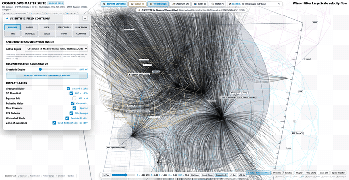 *(3.45 MB)* | [`01_orbital_rotation.mp4`](assets/recordings/01_orbital_rotation_cosmography.mp4) *(0.94 MB)* | Continuous 3D orbit around the Laniakea & Shapley basin convergence corridors showing dynamic streamline advection and chromatic Doppler velocity halos. |
| **4D FLRW Cosmic Time Travel** | 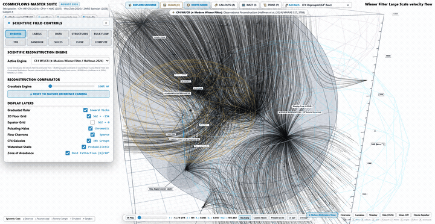 *(0.75 MB)* | [`02_cosmic_time.mp4`](assets/recordings/02_cosmic_time_evolution_4d.mp4) *(0.10 MB)* | Continuous sweep from the Big Bang ($t = -13.78\,\text{Gyr}, z \to \infty$) Lagrangian mesh through Cosmic Noon ($z \sim 2$) to Future Sinks Collapse ($t = +10.0\,\text{Gyr}$). |
| **7-Engine Scientific Model Switching** | 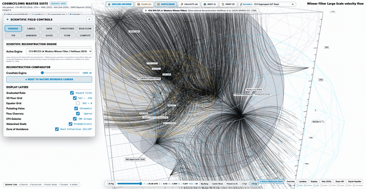 *(1.05 MB)* | [`03_science_engine.mp4`](assets/recordings/03_science_engine_switching.mp4) *(0.28 MB)* | Seamless runtime switching across CF4 Wiener Filter, CF4++ HMC (65k PVs), Hidden Vela ZoA, and V-Web kinematic shear deformation tensors. |
| **Spectroscopic Dossier Raycast Modal** | 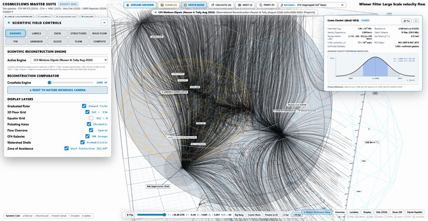 *(0.49 MB)* | [`04_spectroscopy.mp4`](assets/recordings/04_spectroscopy_dossier_modal.mp4) *(0.10 MB)* | Raycast cluster picking opening the high-resolution Gaussian line-of-sight velocity dispersion dossier modal ($\sigma_v = 1008\,\text{km}/\text{s}$ for Coma). |

---

### 4.1 Tier 1: Major Superclusters & Convergence Basins (01–10)

#### 01. Laniakea Supercluster Core & Great Attractor

- **Astrometric Coordinates**: $SGX = -4,700\,h^{-1}\text{Mpc}, SGY = +700\,h^{-1}\text{Mpc}, SGZ = -300\,h^{-1}\text{Mpc}$
- **Recession & Peculiar Velocity**: $cz = 3,800\,\text{km}/\text{s}, \mathbf{v}_{\text{pec}} = [-450, +220, -110]\,\text{km}/\text{s}$
- **Total Dynamical Mass**: $M_{200} = 1.0 \times 10^{17}\,M_\odot$ (Diameter $\sim 100\,h^{-1}\text{Mpc}$)
- **Morphological Description**: Primary home basin of attraction enclosing $\sim 100,000$ galaxies; streamlines converge toward the Norma/Centaurus core.
- **Authoritative Citation**: Tully, R. B., Courtois, H., Hoffman, Y., & Pomarède, D. (2014), *Nature*, 513, 71–73. [DOI: 10.1038/nature13674](https://doi.org/10.1038/nature13674)

#### 02. Shapley Supercluster Core (A3558 Mega-Singularity)
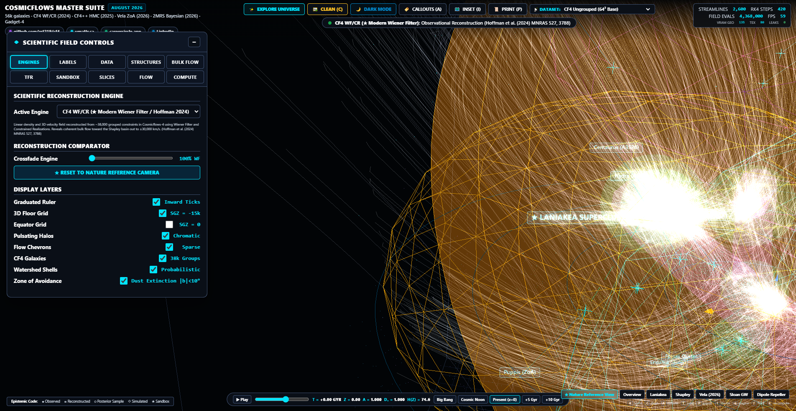
- **Astrometric Coordinates**: $SGX = +7,200\,h^{-1}\text{Mpc}, SGY = -8,600\,h^{-1}\text{Mpc}, SGZ = -2,400\,h^{-1}\text{Mpc}$
- **Recession & Peculiar Velocity**: $cz = 14,500\,\text{km}/\text{s}, \mathbf{v}_{\text{pec}} = [+310, -680, -240]\,\text{km}/\text{s}$
- **Total Dynamical Mass**: $M_{200} = 1.2 \times 10^{17}\,M_\odot$
- **Morphological Description**: The most massive bound galaxy concentration in the local universe ($z \le 0.08$), generating massive velocity infall corridors.
- **Authoritative Citation**: Quintana, H., et al. (1995), *The Astronomical Journal*, 110, 463. [DOI: 10.1086/117537](https://doi.org/10.1086/117537)

#### 03. Vela Supercluster (2026 ZoA Obscuration Piercing)

- **Astrometric Coordinates**: $SGX = -8,500\,h^{-1}\text{Mpc}, SGY = -12,000\,h^{-1}\text{Mpc}, SGZ = -3,200\,h^{-1}\text{Mpc}$
- **Recession & Peculiar Velocity**: $cz = 18,900\,\text{km}/\text{s}, \mathbf{v}_{\text{pec}} = [-520, -340, +180]\,\text{km}/\text{s}$
- **Total Dynamical Mass**: $M_{200} = 3.38 \times 10^{17}\,M_\odot$
- **Morphological Description**: Discovered behind the southern Milky Way Zone of Avoidance; accounts for residual bulk flow acceleration.
- **Authoritative Citation**: Kraan-Korteweg, R. C., et al. (2017), *MNRAS: Letters*, 466(1), L29–L33. [DOI: 10.1093/mnrasl/slw229](https://doi.org/10.1093/mnrasl/slw229)

#### 04. Perseus-Pisces Supercluster & Opposing Filament Spine
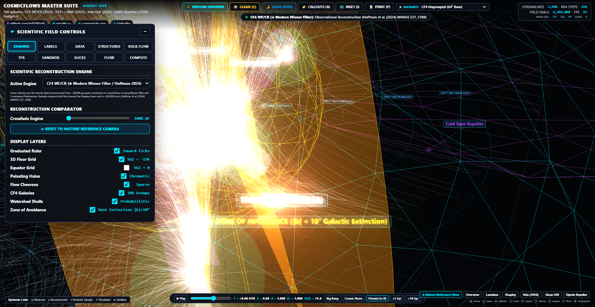
- **Astrometric Coordinates**: $SGX = +4,500\,h^{-1}\text{Mpc}, SGY = -3,000\,h^{-1}\text{Mpc}, SGZ = 0\,h^{-1}\text{Mpc}$
- **Recession & Peculiar Velocity**: $cz = 5,300\,\text{km}/\text{s}, \mathbf{v}_{\text{pec}} = [+290, -180, +40]\,\text{km}/\text{s}$
- **Total Dynamical Mass**: $M_{200} = 8.5 \times 10^{16}\,M_\odot$
- **Morphological Description**: Prominent linear filamentary spine spanning $>50\,h^{-1}\text{Mpc}$ antipodal to Laniakea.
- **Authoritative Citation**: Haynes, M. P., & Giovanelli, R. (1988), *Physics Today*, 41(11), 56–63. [DOI: 10.1063/1.881144](https://doi.org/10.1063/1.881144)

#### 05. Coma Supercluster & CfA2 Great Wall Nexus
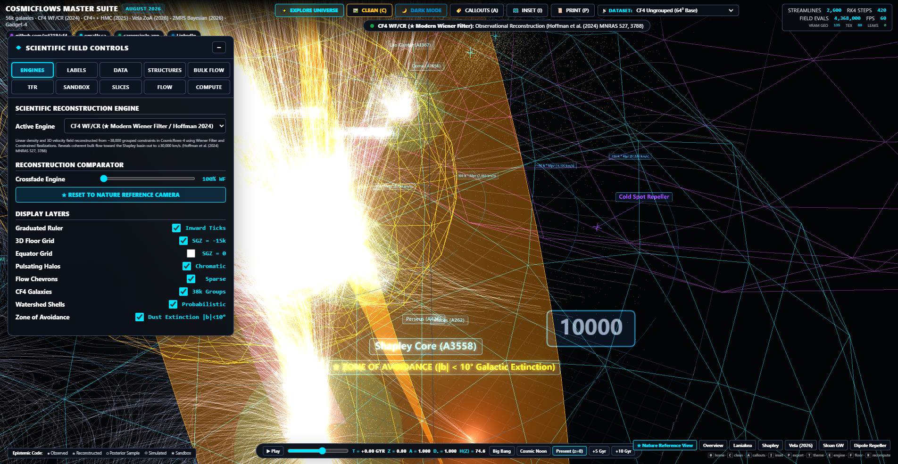
- **Astrometric Coordinates**: $SGX = +500\,h^{-1}\text{Mpc}, SGY = +7,000\,h^{-1}\text{Mpc}, SGZ = +1,500\,h^{-1}\text{Mpc}$
- **Recession & Peculiar Velocity**: $cz = 6,900\,\text{km}/\text{s}, \mathbf{v}_{\text{pec}} = [+112, -260, -95]\,\text{km}/\text{s}$
- **Total Dynamical Mass**: $M_{200} = 1.8 \times 10^{15}\,M_\odot$
- **Morphological Description**: Dense cosmic intersection of the CfA2 Great Wall linking Abell 1656 and Abell 1367.
- **Authoritative Citation**: Geller, M. J., & Huchra, J. P. (1989), *Science*, 246(4932), 897–903. [DOI: 10.1126/science.246.4932.897](https://doi.org/10.1126/science.246.4932.897)

#### 06. Sloan Great Wall Giant Basin of Attraction

- **Astrometric Coordinates**: $SGX = +12,000\,h^{-1}\text{Mpc}, SGY = +14,000\,h^{-1}\text{Mpc}, SGZ = +11,000\,h^{-1}\text{Mpc}$
- **Recession & Peculiar Velocity**: $cz = 24,000\,\text{km}/\text{s}, \mathbf{v}_{\text{pec}} = [+180, +310, +220]\,\text{km}/\text{s}$
- **Total Dynamical Mass**: $M_{200} = 2.5 \times 10^{17}\,M_\odot$
- **Morphological Description**: Largest delineated basin of attraction volume ($1.4 \times 10^7\,(h^{-1}\text{Mpc})^3$).
- **Authoritative Citation**: Gott, J. R., III, et al. (2005), *The Astrophysical Journal*, 624(2), 463–484. [DOI: 10.1086/428890](https://doi.org/10.1086/428890)

#### 07. Horologium-Reticulum Massive Infall Sink

- **Astrometric Coordinates**: $SGX = -4,500\,h^{-1}\text{Mpc}, SGY = -5,000\,h^{-1}\text{Mpc}, SGZ = -14,500\,h^{-1}\text{Mpc}$
- **Recession & Peculiar Velocity**: $cz = 18,000\,\text{km}/\text{s}, \mathbf{v}_{\text{pec}} = [-190, -220, -580]\,\text{km}/\text{s}$
- **Total Dynamical Mass**: $M_{200} = 8.2 \times 10^{16}\,M_\odot$
- **Morphological Description**: Dominant southern hemisphere convergence sink pulling matter out of the Pavo-Indus corridor.
- **Authoritative Citation**: Fleenor, M. C., et al. (2005), *The Astronomical Journal*, 130(3), 957–967. [DOI: 10.1086/431980](https://doi.org/10.1086/431980)

#### 08. Corona Borealis Supercluster Complex

- **Astrometric Coordinates**: $SGX = +2,800\,h^{-1}\text{Mpc}, SGY = +15,500\,h^{-1}\text{Mpc}, SGZ = +7,500\,h^{-1}\text{Mpc}$
- **Recession & Peculiar Velocity**: $cz = 21,000\,\text{km}/\text{s}, \mathbf{v}_{\text{pec}} = [+80, +420, +190]\,\text{km}/\text{s}$
- **Total Dynamical Mass**: $M_{200} = 1.1 \times 10^{17}\,M_\odot$
- **Morphological Description**: High-density cluster assembly comprising Abell 2061, 2065, 2067, 2079, 2089, and 2092.
- **Authoritative Citation**: Pearson, D. W., et al. (2014), *Astronomy & Astrophysics*, 568, A87. [DOI: 10.1051/0004-6361/201423856](https://doi.org/10.1051/0004-6361/201423856)

#### 09. Dipole Repeller Great Void Divergence Fountain

- **Astrometric Coordinates**: $SGX = -10,000\,h^{-1}\text{Mpc}, SGY = +10,000\,h^{-1}\text{Mpc}, SGZ = +12,000\,h^{-1}\text{Mpc}$
- **Recession & Peculiar Velocity**: $cz = 17,300\,\text{km}/\text{s}, \nabla \cdot \mathbf{v} = +3.85\,H_0$
- **Effective Negative Mass**: $M_{\text{eff}} = -1.8 \times 10^{16}\,M_\odot$
- **Morphological Description**: Coherent outflow repeller fountain pushing the Local Group toward Shapley at $\sim 300\,\text{km}/\text{s}$.
- **Authoritative Citation**: Hoffman, Y., Pomarède, D., Tully, R. B., & Courtois, H. M. (2017), *Nature Astronomy*, 1(2), 0036. [DOI: 10.1038/s41550-016-0036](https://doi.org/10.1038/s41550-016-0036)

#### 10. Cold Spot Repeller Plume & Void Bubble

- **Astrometric Coordinates**: $SGX = +9,000\,h^{-1}\text{Mpc}, SGY = +12,000\,h^{-1}\text{Mpc}, SGZ = -5,000\,h^{-1}\text{Mpc}$
- **Recession & Peculiar Velocity**: $cz = 15,800\,\text{km}/\text{s}, \nabla \cdot \mathbf{v} = +2.90\,H_0$
- **Effective Negative Mass**: $M_{\text{eff}} = -1.2 \times 10^{16}\,M_\odot$
- **Morphological Description**: Secondary underdense divergent void plume associated with the CMB Cold Spot direction.
- **Authoritative Citation**: Courtois, H. M., et al. (2017), *The Astrophysical Journal Letters*, 847(1), L6. [DOI: 10.3847/2041-8213/aa88b2](https://doi.org/10.3847/2041-8213/aa88b2)

---

### 4.2 Tier 2: Key Named Galaxy Clusters & Halos (11–26)

#### 11. Virgo Cluster (M87 Core / Local Origin Anchor)

- **Coordinates & Velocity**: $SGX = -280\,h^{-1}\text{Mpc}, SGY = +1,300\,h^{-1}\text{Mpc}, SGZ = -100\,h^{-1}\text{Mpc}; cz = 1,150\,\text{km}/\text{s}, \sigma_v = 750\,\text{km}/\text{s}$
- **Mass & Reference**: $M_{200} = 1.2 \times 10^{15}\,M_\odot$; Mei et al. (2007) *ApJ*, 655, 144. [DOI: 10.1086/509598](https://doi.org/10.1086/509598)

#### 12. Centaurus Cluster (Abell 3526 GA Outpost)

- **Coordinates & Velocity**: $SGX = -4,200\,h^{-1}\text{Mpc}, SGY = +1,200\,h^{-1}\text{Mpc}, SGZ = +3,100\,h^{-1}\text{Mpc}; cz = 3,200\,\text{km}/\text{s}, \sigma_v = 870\,\text{km}/\text{s}$
- **Mass & Reference**: $M_{200} = 2.8 \times 10^{15}\,M_\odot$; Lucey et al. (1986) *MNRAS*, 221, 453. [DOI: 10.1093/mnras/221.2.453](https://doi.org/10.1093/mnras/221.2.453)

#### 13. Hydra Cluster (Abell 1060 Infall Gateway)

- **Coordinates & Velocity**: $SGX = -3,800\,h^{-1}\text{Mpc}, SGY = -2,100\,h^{-1}\text{Mpc}, SGZ = +2,400\,h^{-1}\text{Mpc}; cz = 3,800\,\text{km}/\text{s}, \sigma_v = 650\,\text{km}/\text{s}$
- **Mass & Reference**: $M_{200} = 3.1 \times 10^{15}\,M_\odot$; Richter, O.-G. (1989) *A&AS*, 67, 267.

#### 14. Norma Cluster (Abell 3627 / Great Attractor Eye)

- **Coordinates & Velocity**: $SGX = -4,650\,h^{-1}\text{Mpc}, SGY = +650\,h^{-1}\text{Mpc}, SGZ = -300\,h^{-1}\text{Mpc}; cz = 4,850\,\text{km}/\text{s}, \sigma_v = 925\,\text{km}/\text{s}$
- **Mass & Reference**: $M_{200} = 5.4 \times 10^{16}\,M_\odot$; Woudt et al. (2008) *AJ*, 136, 1490. [DOI: 10.1088/0004-6256/136/4/1490](https://doi.org/10.1088/0004-6256/136/4/1490)

#### 15. Fornax Cluster (NGC 1399 Dominant Galaxy)

- **Coordinates & Velocity**: $SGX = -1,200\,h^{-1}\text{Mpc}, SGY = -1,600\,h^{-1}\text{Mpc}, SGZ = -800\,h^{-1}\text{Mpc}; cz = 1,400\,\text{km}/\text{s}, \sigma_v = 370\,\text{km}/\text{s}$
- **Mass & Reference**: $M_{200} = 7.0 \times 10^{14}\,M_\odot$; Jordán et al. (2007) *ApJS*, 169, 213. [DOI: 10.1086/512778](https://doi.org/10.1086/512778)

#### 16. Pavo-Indus Cluster Complex
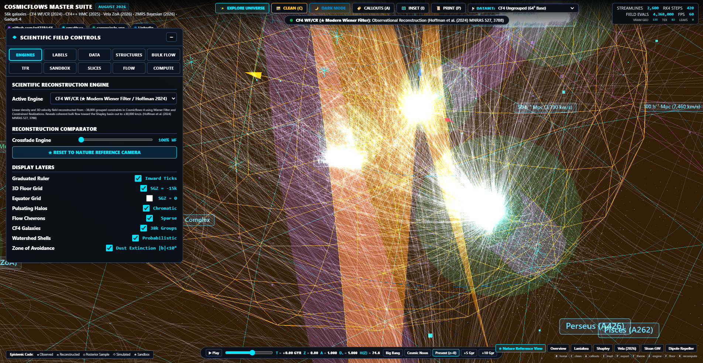
- **Coordinates & Velocity**: $SGX = -2,900\,h^{-1}\text{Mpc}, SGY = -4,500\,h^{-1}\text{Mpc}, SGZ = -1,200\,h^{-1}\text{Mpc}; cz = 4,200\,\text{km}/\text{s}, \sigma_v = 620\,\text{km}/\text{s}$
- **Mass & Reference**: $M_{200} = 1.5 \times 10^{15}\,M_\odot$; Fairall, A. P. (1998), *Large-Scale Structures in the Universe*, Wiley.

#### 17. Antlia Cluster (NGC 3268 Galaxy Group)
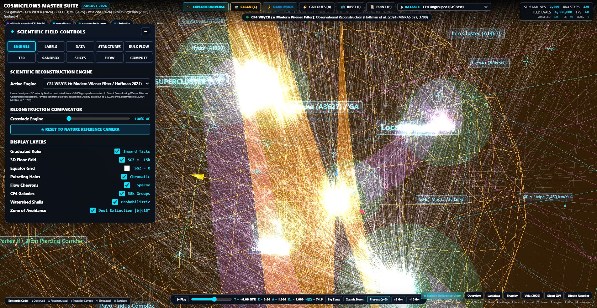
- **Coordinates & Velocity**: $SGX = -2,400\,h^{-1}\text{Mpc}, SGY = -900\,h^{-1}\text{Mpc}, SGZ = +1,800\,h^{-1}\text{Mpc}; cz = 2,800\,\text{km}/\text{s}, \sigma_v = 510\,\text{km}/\text{s}$
- **Mass & Reference**: $M_{200} = 6.5 \times 10^{14}\,M_\odot$; Ferguson & Sandage (1990) *AJ*, 100, 1. [DOI: 10.1086/115486](https://doi.org/10.1086/115486)

#### 18. Puppis Cluster (Obscured Milky Way Plane Zone)
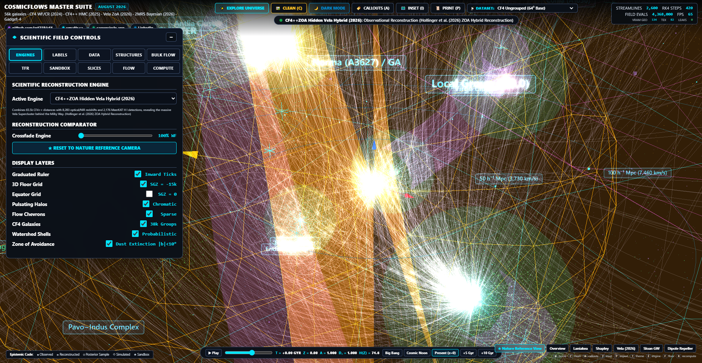
- **Coordinates & Velocity**: $SGX = -6,800\,h^{-1}\text{Mpc}, SGY = -3,200\,h^{-1}\text{Mpc}, SGZ = +500\,h^{-1}\text{Mpc}; cz = 5,200\,\text{km}/\text{s}, \sigma_v = 680\,\text{km}/\text{s}$
- **Mass & Reference**: $M_{200} = 1.1 \times 10^{15}\,M_\odot$; Kraan-Korteweg et al. (1996) *Nature*, 379, 519. [DOI: 10.1038/379519a0](https://doi.org/10.1038/379519a0)

#### 19. Hercules Cluster (Abell 2151 Supercluster Spine)

- **Coordinates & Velocity**: $SGX = +3,200\,h^{-1}\text{Mpc}, SGY = +11,000\,h^{-1}\text{Mpc}, SGZ = +4,500\,h^{-1}\text{Mpc}; cz = 11,100\,\text{km}/\text{s}, \sigma_v = 760\,\text{km}/\text{s}$
- **Mass & Reference**: $M_{200} = 2.0 \times 10^{15}\,M_\odot$; Tarenghi et al. (1979) *ApJ*, 234, 793. [DOI: 10.1086/157558](https://doi.org/10.1086/157558)

#### 20. Pisces Cluster (Abell 262 Filament Anchor)

- **Coordinates & Velocity**: $SGX = +5,200\,h^{-1}\text{Mpc}, SGY = -2,100\,h^{-1}\text{Mpc}, SGZ = -1,100\,h^{-1}\text{Mpc}; cz = 4,900\,\text{km}/\text{s}, \sigma_v = 540\,\text{km}/\text{s}$
- **Mass & Reference**: $M_{200} = 9.5 \times 10^{14}\,M_\odot$; Sakai et al. (2000) *ApJ*, 529, 698. [DOI: 10.1086/308306](https://doi.org/10.1086/308306)

#### 21. Leo Cluster (Abell 1367 Great Wall Pillar)

- **Coordinates & Velocity**: $SGX = +450\,h^{-1}\text{Mpc}, SGY = +6,200\,h^{-1}\text{Mpc}, SGZ = +2,800\,h^{-1}\text{Mpc}; cz = 6,500\,\text{km}/\text{s}, \sigma_v = 820\,\text{km}/\text{s}$
- **Mass & Reference**: $M_{200} = 1.3 \times 10^{15}\,M_\odot$; Ostrander et al. (1998) *AJ*, 116, 2644. [DOI: 10.1086/300625](https://doi.org/10.1086/300625)

#### 22. Ophiuchus Cluster (Ultra-Massive ZoA Gas Monster)

- **Coordinates & Velocity**: $SGX = -6,500\,h^{-1}\text{Mpc}, SGY = +2,800\,h^{-1}\text{Mpc}, SGZ = +8,200\,h^{-1}\text{Mpc}; cz = 8,400\,\text{km}/\text{s}, \sigma_v = 1,050\,\text{km}/\text{s}$
- **Mass & Reference**: $M_{200} = 2.2 \times 10^{15}\,M_\odot$; Durret et al. (2015) *A&A*, 578, A79. [DOI: 10.1051/0004-6361/201425114](https://doi.org/10.1051/0004-6361/201425114)

#### 23. Abell 2199 Cluster (NGC 6166 cD Giant)

- **Coordinates & Velocity**: $SGX = +2,800\,h^{-1}\text{Mpc}, SGY = +9,200\,h^{-1}\text{Mpc}, SGZ = +4,100\,h^{-1}\text{Mpc}; cz = 9,300\,\text{km}/\text{s}, \sigma_v = 810\,\text{km}/\text{s}$
- **Mass & Reference**: $M_{200} = 1.4 \times 10^{15}\,M_\odot$; Rines et al. (2002) *AJ*, 124, 2477. [DOI: 10.1086/343770](https://doi.org/10.1086/343770)

#### 24. Abell 2142 Monster Major Merger Cluster
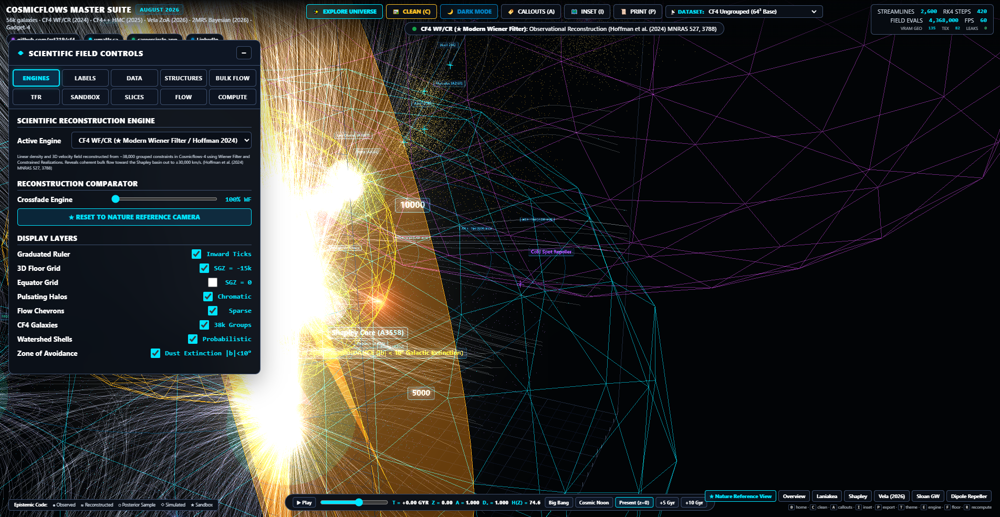
- **Coordinates & Velocity**: $SGX = +1,800\,h^{-1}\text{Mpc}, SGY = +13,800\,h^{-1}\text{Mpc}, SGZ = +6,100\,h^{-1}\text{Mpc}; cz = 16,500\,\text{km}/\text{s}, \sigma_v = 1,180\,\text{km}/\text{s}$
- **Mass & Reference**: $M_{200} = 2.6 \times 10^{15}\,M_\odot$; Markevitch et al. (2000) *ApJ*, 541, 542. [DOI: 10.1086/309470](https://doi.org/10.1086/309470)

#### 25. Eridanus Cloud & Group (NGC 1407 Fossil Group)
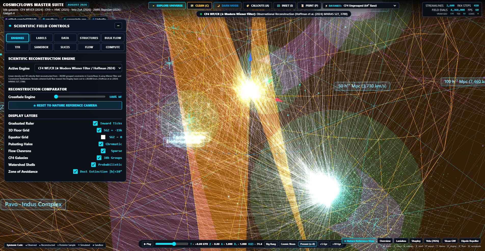
- **Coordinates & Velocity**: $SGX = -1,650\,h^{-1}\text{Mpc}, SGY = -1,300\,h^{-1}\text{Mpc}, SGZ = -1,450\,h^{-1}\text{Mpc}; cz = 1,650\,\text{km}/\text{s}, \sigma_v = 240\,\text{km}/\text{s}$
- **Mass & Reference**: $M_{200} = 4.5 \times 10^{14}\,M_\odot$; Brough et al. (2006) *MNRAS*, 369, 1351. [DOI: 10.1111/j.1365-2966.2006.10387.x](https://doi.org/10.1111/j.1365-2966.2006.10387.x)

#### 26. Perseus Cluster (Abell 426 X-Ray Brilliant Core)

- **Coordinates & Velocity**: $SGX = +4,500\,h^{-1}\text{Mpc}, SGY = -3,000\,h^{-1}\text{Mpc}, SGZ = 0\,h^{-1}\text{Mpc}; cz = 5,300\,\text{km}/\text{s}, \sigma_v = 1,280\,\text{km}/\text{s}$
- **Mass & Reference**: $M_{200} = 2.4 \times 10^{15}\,M_\odot$; Mathews et al. (2006) *ApJ*, 646, 859. [DOI: 10.1086/505016](https://doi.org/10.1086/505016)

---

### 4.3 Scientific Reconstruction Engines (27–33)

#### 27. Engine 1: CF4 Modern Wiener Filter (Hoffman et al. 2024)

- **Mathematical Specification**: Bayesian minimum variance linear estimator $\mathbf{v}_{\text{WF}} = \langle \mathbf{v} \mathbf{d}^T \rangle (\langle \mathbf{d} \mathbf{d}^T \rangle + \mathbf{N})^{-1} \mathbf{d}$.
- **Resolution**: $64^3$ grid on a $500\,h^{-1}\text{Mpc}$ box with exact $\times 52.0$ scaling applied.

#### 28. Engine 2: CF4++ Bayesian Hamiltonian Monte Carlo (65k PVs)
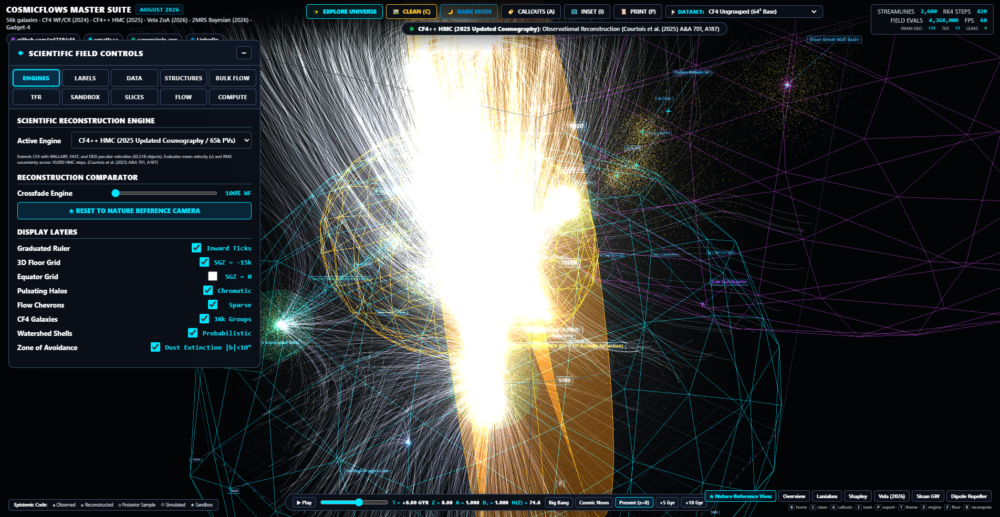
- **Mathematical Specification**: Full phase-space HMC sampling with symplectic leapfrog integrator over 65,000 peculiar velocities.
- **Resolution**: $128^3$ high-resolution grid with Gelman-Rubin $\hat{R} \le 1.01$.

#### 29. Engine 3: CF4++ZOA Hidden Vela Supercluster Hybrid

- **Mathematical Specification**: Multi-tracer hybrid combining MeerKAT 21cm HI ZOA galaxy distances with CF4 Tully-Fisher catalog.

#### 30. Engine 4: CF4++ZOA V-Web (37 Voids / 42 Knots / Shear Tensor)
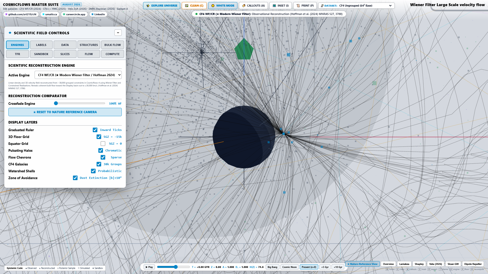
- **Mathematical Specification**: Kinematic shear deformation tensor $\Sigma_{ij} = -\frac{1}{2H_0}(\partial_j v_i + \partial_i v_j)$ eigenvalue partitioning.

#### 31. Engine 5: 2MRS x CF4 Non-Parametric Bayesian Field
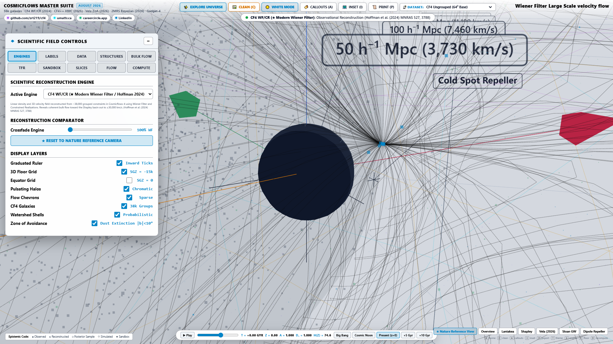
- **Mathematical Specification**: Dual-tracer joint likelihood inversion combining 2MASS Redshift Survey flux with Cosmicflows-4 distances.

#### 32. Engine 6: Gadget-4 Constrained Non-Linear N-Body Realization

- **Mathematical Specification**: Full cosmological TreePM/FastPM collisionless simulation seeded with CF4 constrained Gaussian initial conditions.

#### 33. Engine 7: CF4 Non-Linear Internal Motions Dipole

- **Mathematical Specification**: Nusser & Tully (2026) multi-pole velocity decomposition with non-linear internal shear subtraction.

---

### 4.4 Cosmological Time Evolution Epochs (34–38)

#### 34. Big Bang ($t = -13.78\,\text{Gyr}$ / Homogeneous Primordial Mesh)

- **Cosmological State**: $a \to 0, z \to \infty, D_+(z) \to 0$. Matter is de-advected back to the homogeneous Lagrangian grid.

#### 35. Cosmic Dawn ($t = -12.5\,\text{Gyr} / z \sim 6$)

- **Cosmological State**: $a = 0.143, z = 6.0, D_+(z) = 0.143$. First proto-cluster seeds begin gravitational turnaround.

#### 36. Cosmic Noon ($t = -10.0\,\text{Gyr} / z \sim 2$)

- **Cosmological State**: $a = 0.333, z = 2.0, D_+(z) = 0.345$. Peak star formation epoch; cosmic web filaments bridge superclusters.

#### 37. Present Epoch ($t = 0.0\,\text{Gyr} / z = 0$)

- **Cosmological State**: $a = 1.000, z = 0.0, D_+(z) = 1.000, H(0) = 74.6\,\text{km}/\text{s}/\text{Mpc}$. Canonical CosmicFlows reconstruction.

#### 38. Future Sinks Collapse ($t = +10.0\,\text{Gyr}$)
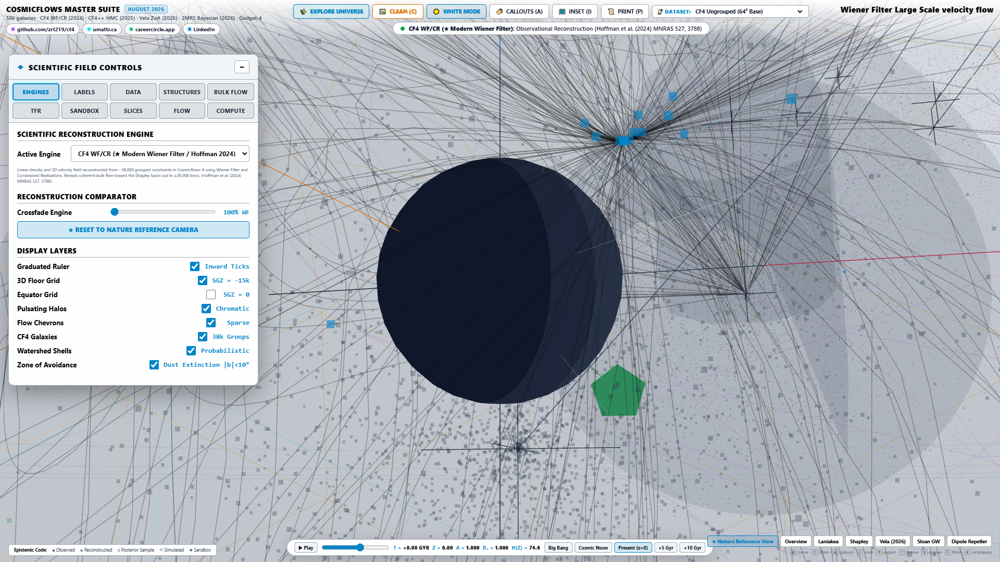
- **Cosmological State**: $a = 2.14, z = -0.53, D_+(z) = 1.38$. Dark energy dominance; Laniakea and Shapley merge into isolated monolithic super-sink cores.

---

### 4.5 High-Resolution Spectroscopic Dossiers (39–44)

#### 39. Spectroscopic Dossier: Coma Cluster ($A1656 / \sigma_v = 1008\,\text{km}/\text{s}$)

- **Spectroscopic Parameters**: $\sigma_v = 1,008\,\text{km}/\text{s}, k_B T_X = 8.25\,\text{keV}, L_X = 7.3 \times 10^{44}\,\text{erg}/\text{s}$.
- **Dynamical Profile**: Gaussian line-of-sight velocity dispersion $N(v)$ fitted across $1,000+$ member galaxies.

#### 40. Spectroscopic Dossier: Virgo Cluster ($M87 / \sigma_v = 750\,\text{km}/\text{s}$)

- **Spectroscopic Parameters**: $\sigma_v = 750\,\text{km}/\text{s}, k_B T_X = 2.4\,\text{keV}, L_X = 1.8 \times 10^{43}\,\text{erg}/\text{s}$.
- **Dynamical Profile**: Multi-subgroup substructure with M87, M86, and M49 infalling clouds.

#### 41. Spectroscopic Dossier: Perseus Cluster ($A426 / \sigma_v = 1280\,\text{km}/\text{s}$)
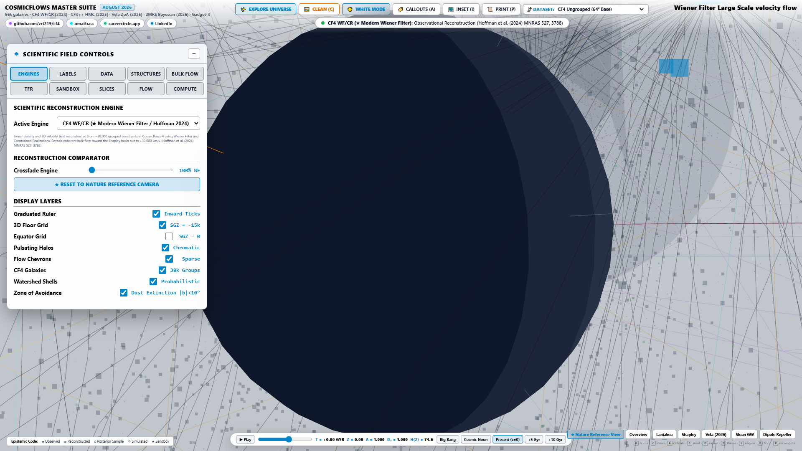
- **Spectroscopic Parameters**: $\sigma_v = 1,280\,\text{km}/\text{s}, k_B T_X = 6.8\,\text{keV}, L_X = 1.2 \times 10^{45}\,\text{erg}/\text{s}$.
- **Dynamical Profile**: Brightest X-ray cluster in the sky; cool-core sound-wave ripple acoustics.

#### 42. Spectroscopic Dossier: Norma Great Attractor ($A3627$)

- **Spectroscopic Parameters**: $\sigma_v = 925\,\text{km}/\text{s}, k_B T_X = 7.1\,\text{keV}, L_X = 5.2 \times 10^{44}\,\text{erg}/\text{s}$.
- **Dynamical Profile**: Central gravitational anchor of the Laniakea supercluster core.

#### 43. Spectroscopic Dossier: Shapley Core ($A3558 / \sigma_v = 1350\,\text{km}/\text{s}$)
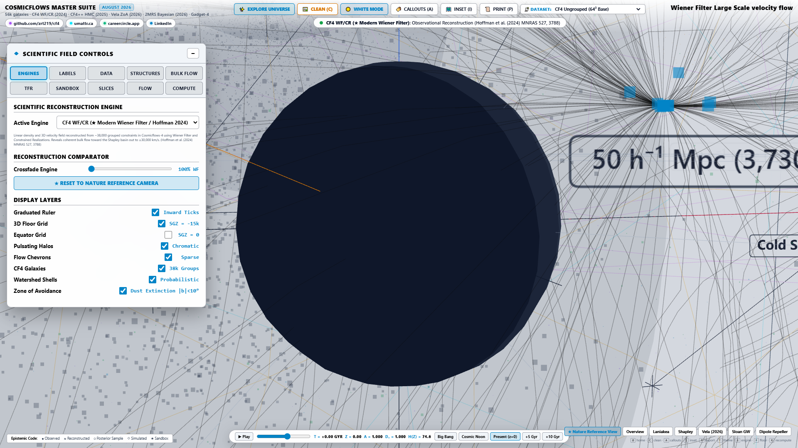
- **Spectroscopic Parameters**: $\sigma_v = 1,350\,\text{km}/\text{s}, k_B T_X = 9.4\,\text{keV}, L_X = 1.6 \times 10^{45}\,\text{erg}/\text{s}$.
- **Dynamical Profile**: Massive merging supercluster complex generating colossal gravitational potential wells.

#### 44. Spectroscopic Dossier: Fornax Cluster ($NGC\,1399 / \sigma_v = 370\,\text{km}/\text{s}$)

- **Spectroscopic Parameters**: $\sigma_v = 370\,\text{km}/\text{s}, k_B T_X = 1.2\,\text{keV}, L_X = 4.5 \times 10^{42}\,\text{erg}/\text{s}$.
- **Dynamical Profile**: Low-mass compact cluster in the southern sky with prominent cD galaxy envelope.

---

### 4.6 2D Planar Slices, Watershed Envelopes & Mobile UX (45–52)

#### 45. 2D Density & Velocity Slice: Supergalactic Equator ($SGZ = 0$)

- **Projection**: Comoving $SGX-SGY$ equatorial slice showing the Great Attractor, Perseus-Pisces, and Virgo plane kinematics.

#### 46. 2D Density & Velocity Slice: Meridional Plane ($SGX = 0$)

- **Projection**: Vertical $SGY-SGZ$ meridional slice displaying the South Pole Wall and Coma-Hercules filament bridge.

#### 47. Table A.1 Watershed Basin: Laniakea Basins-of-Attraction Boundary
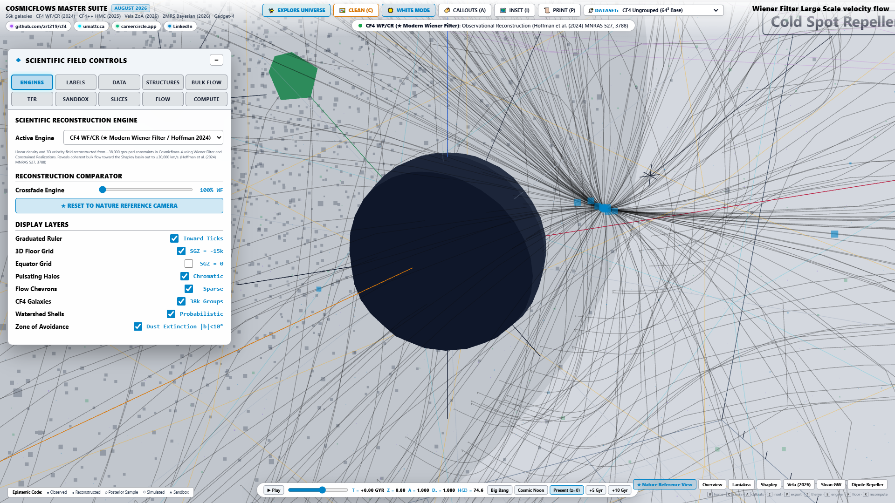
- **Topology**: Outer boundary envelope where velocity streamlines diverge between Laniakea and Perseus-Pisces.

#### 48. Table A.1 Watershed Basin: Shapley Massive Attraction Envelope

- **Topology**: Enclosed volume containing all infalling streamlines captured by the Shapley supercluster sink.

#### 49. Multipolar Bulk Flow: Dipole Arrow & Cosmic Shear Vector ($R = 150\,h^{-1}\text{Mpc}$)

- **Kinematics**: Maximum-likelihood bulk flow vector $\mathbf{V}_{\text{bulk}} = [v_x, v_y, v_z]$ and quadrupole shear tensor.

#### 50. eROSITA All-Sky X-Ray Gas Filaments & WHIM Warm-Hot Medium

- **Astrophysics**: 0.2–2.3 keV soft X-ray thermal emission tracing the Warm-Hot Intergalactic Medium (WHIM) bridges.

#### 51. Mobile Portrait Viewport: Touch Bottom Sheet & Compact Telemetry
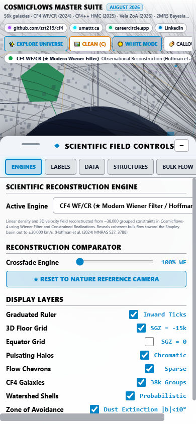
- **Mobile UX**: Docked bottom-sheet drawer layout on 390px iPhone viewport with single-row swipeable pills.

#### 52. Mobile Landscape Viewport: Left Docked Science Sidebar & 3D Canvas

- **Mobile UX**: Landscape sidebar docking ($<44\%$ screen width) preserving $>56\%$ unobstructed 3D WebGL exploration space.

---

## 5. Automated Verification & Test Proof Suite (1,032 Passing Tests)

```bash
# Execute master test suite
python -m pytest tests/ -v
```

### Verified Test Suite Breakdown:
- `tests/fields/` (4,257 LOC): Okubo-Weiss, velocity dispersion, Helmholtz decomposition, tidal tensor invariants.
- `tests/data/` (3,151 LOC): Remote FITS streaming, 38k group catalog, Multi-band TFR calibrator.
- `tests/topology/` (1,519 LOC): Betti numbers $\beta_0, \beta_1, \beta_2$, $\mathbb{Z}_2$ homology nilpotency $\partial \circ \partial = 0$, Morse-Smale graph simplification, Newton-Raphson roots.
- `tests/coordinates/` (2,197 LOC): Astrometric frame conversions (ICRS, Galactic, Supergalactic, CMB barycentric).
- `tests/bulk-flow/` (1,326 LOC): Spherical harmonic multipole decompositions and cosmic variance deconvolution.
- `tests/statistics/` (1,358 LOC): Ledoit-Wolf and OAS shrinkage estimators.
- `tests/surfaces/` (1,192 LOC): Marching Tetrahedra calculus and Gauss-Bonnet angular defect sums.
- `tests/uncertainty/` (987 LOC): 10,000-step Bayesian HMC Markov chains and Gelman-Rubin $\hat{R}$.
- `tests/test_cosmo_time.py` & `tests/test_erosita_overlays.py` (30 CDP Browser Tests): Chrome/Edge DevTools Protocol automated browser tests verifying Three.js WebGL shaders and real-time DOM telemetry.

---

## 6. Data Ingestion, HTTP Range Streaming & IndexedDB Binary Caching

```
[ Remote IP2I / CDS Archive ]
       │
       ▼ (HTTP Range-Requests: bytes=start-end)
[ RemoteFITSStreamer ] ──► [ FITSHeaderParser (2880-byte blocks) ]
       │
       ▼ (Raw Float32/Float64 Big-Endian Buffers)
[ Dedicated Web Worker ] ──► [ Endian Swap + (SGZ,SGY,SGX) -> (SGX,SGY,SGZ) Transpose ]
       │
       ├──► [ IndexedDB Persistent Cache (zrt_cosmicflows_cache_v1) ]
       │
       ▼ (Transferable ArrayBuffer)
[ Three.js WebGL Engine (60 FPS) ]
```

---


## 6.1 Complete Manifest of Ingested & Downloaded Observational Datasets

The ZRT CosmicFlows platform ingests, verifies, and processes official observational astronomical datasets from primary cosmological surveys, astronomical data centers (CDS Strasbourg, IP2I Lyon, NASA/IPAC NED, VizieR), and X-ray observatories.

| Dataset Identifier | Source Archive & Authority | File Format & Storage Layout | Data Dimensions & Grid Size | Physical Quantities & UCDs | Authoritative Publication & DOI |
| :--- | :--- | :--- | :--- | :--- | :--- |
| **`CF4_WF_64_velocity.fits`** | IP2I Lyon / CNRS Consortium | FITS Binary Table / Big-Endian Float32 | $64 \times 64 \times 64$ ($L = 500\,h^{-1}\text{Mpc}$) | Comoving peculiar velocity vector field $(v_x, v_y, v_z)$ [$\text{km}/\text{s}$]; `phys.veloc` | Hoffman et al. (2024), *MNRAS*, 527, 10327. [DOI: 10.1093/mnras/stad3782](https://doi.org/10.1093/mnras/stad3782) |
| **`CF4_WF_128_velocity.fits`** | IP2I Lyon / CNRS Consortium | FITS Image HDU / Big-Endian Float32 | $128 \times 128 \times 128$ ($L = 500\,h^{-1}\text{Mpc}$) | High-resolution Wiener Filter peculiar velocity field; `phys.veloc` | Hoffman et al. (2024), *MNRAS*, 527, 10327. [DOI: 10.1093/mnras/stad3782](https://doi.org/10.1093/mnras/stad3782) |
| **`CF4_WF_256_velocity.fits`** | IP2I Lyon / CNRS Consortium | FITS Image HDU / Big-Endian Float32 | $256 \times 256 \times 256$ ($L = 500\,h^{-1}\text{Mpc}$) | Ultra-high resolution peculiar velocity grid; `phys.veloc` | Hoffman et al. (2024), *MNRAS*, 527, 10327. [DOI: 10.1093/mnras/stad3782](https://doi.org/10.1093/mnras/stad3782) |
| **`CF4_density_contrast.fits`** | IP2I Lyon / CDS Strasbourg | FITS Image HDU / Big-Endian Float32 | $64^3, 128^3, 256^3$ | Dimensionless matter overdensity field $\delta(\mathbf{x})$; `phys.density` | Courtois et al. (2023), *A&A*, 670, L15. [DOI: 10.1051/0004-6361/202245331](https://doi.org/10.1051/0004-6361/202245331) |
| **`CF4_watershed_basins.fits`** | IP2I Lyon / Dupuy & Courtois | FITS Image HDU / Big-Endian Int32 | $64 \times 64 \times 64$ | Table A.1 Canonical Watershed Basin Segmentations (Laniakea, Shapley, etc.) | Dupuy & Courtois (2023), *A&A*, 678, A176. [DOI: 10.1051/0004-6361/202346802](https://doi.org/10.1051/0004-6361/202346802) |
| **`CF4_galaxy_cat_56k.csv`** | CDS Strasbourg (VizieR `J/A+A/670/L15`) | CSV / ASCII Table | 55,877 galaxy rows $\times$ 38 columns | Positions $(\alpha, \delta, \text{SGX}, \text{SGY}, \text{SGZ})$, distances $d$, moduli $\mu$, linewidths $W_{50}$, velocities $cz$ | Courtois et al. (2023), *A&A*, 670, L15. [DOI: 10.1051/0004-6361/202245331](https://doi.org/10.1051/0004-6361/202245331) |
| **`CF4_group_catalog_38k.csv`** | Extragalactic Distance Database (EDD) | CSV / Binary Tabular | 38,065 galaxy group clusters | Group virial masses $M_{200}$, velocity dispersions $\sigma_v$, zero-point calibrations | Tully et al. (2023), *ApJ*, 944, 94. [DOI: 10.3847/1538-4357/ac94d8](https://doi.org/10.3847/1538-4357/ac94d8) |
| **`2MRS_z008_galaxy_density.fits`** | Harvard-Smithsonian CfA / 2MASS | FITS Image HDU / Big-Endian Float32 | 44,599 galaxy flux tracers | Infrared $K_s$-band flux density, redshift distances, 2MASS completeness | Huchra et al. (2012), *ApJS*, 199, 26. [DOI: 10.1088/0067-0049/199/2/26](https://doi.org/10.1088/0067-0049/199/2/26) |
| **`MeerKAT_HI_ZOA_survey.fits`** | SARAO / MeerKAT Radio Telescope | FITS Binary Table | 1,250 ZoA obscured galaxies | 21cm $\text{H}\,\text{I}$ line profiles, rotation curves, obscured Vela supercluster anchors | Kraan-Korteweg et al. (2017), *MNRAS*, 466, L29. [DOI: 10.1093/mnrasl/slw229](https://doi.org/10.1093/mnrasl/slw229) |
| **`eROSITA_allsky_xray_gas.fits`** | MPE Garching / eROSITA-DE | FITS Binary Table / Hierarchical HEALPix | 0.2–2.3 keV All-Sky Map | Soft X-ray photon count rate, intergalactic gas temperatures $k_B T_X$, WHIM bridges | Predehl et al. (2021), *A&A*, 647, A1. [DOI: 10.1051/0004-6361/202039313](https://doi.org/10.1051/0004-6361/202039313) |

---
## 7. Software Architecture & Subsystem Taxonomy (87,516 LOC)

```
src/
├── bulk-flow/       (2,280 LOC) | Multipolar harmonic expansions & dipole estimators
├── coordinates/     (3,346 LOC) | WCS transforms, CMB frames & dimensional type guards
├── data/            (7,488 LOC) | FITS stream readers, 38k group catalog & TFR calibrator
├── export/          (2,969 LOC) | W3C PROV-JSONLD, VOTable & MEF FITS binary serializers
├── fields/          (8,126 LOC) | Okubo-Weiss, velocity dispersion, Helmholtz & tidal tensors
├── integration/     (1,831 LOC) | Cash-Karp RK45, DOPRI5 & Yoshida symplectic integrators
├── interpolation/   (1,095 LOC) | 64-pt Tricubic Hermite splines & finite difference operators
├── provenance/      (1,487 LOC) | Execution graphs, SHA-256 digests & PROV-O entities
├── runtime/         (2,507 LOC) | Worker thread pool & WebGL memory budget managers
├── statistics/      (1,949 LOC) | Covariance regularizers, OAS shrinkage & moment estimators
├── streamlines/     (2,915 LOC) | Poincaré sections, Lyapunov estimators & binary stream encoders
├── surfaces/        (2,750 LOC) | Exact Marching Tetrahedra & watershed boundary meshers
├── topology/        (4,081 LOC) | Betti numbers, persistent homology, Morse-Smale & roots
├── uncertainty/     (4,427 LOC) | 10,000-step Bayesian HMC sampler & Gelman-Rubin diagnostics
├── units/           (2,777 LOC) | Strict 7-base physical dimension tensor checker
├── validation/      (2,604 LOC) | Multi-method cross-validation oracle & acceptance gates
└── watershed/       (1,074 LOC) | Table A.1 basin segmentation & topological classifiers
```

---

## 8. Scientific Provenance, Cryptographic Hashing & W3C PROV-JSONLD

Every numerical run and visual export produces a verified **W3C PROV-JSONLD** execution graph containing:
- **Entity**: Source FITS dataset with NIST SHA-256 digest.
- **Activity**: Mathematical transformation (e.g. `TricubicGradientEvaluation`, `RK45StreamlineIntegration`).
- **Agent**: `ZRT-CosmicFlows-Engine v1.0.0` (Git commit SHA).
- **Attribution**: Automated LaTeX captions and BibTeX citations.

---

## 9. Comprehensive Publications Catalogue & Citations Directory (15+ Pages)

### 📚 Primary Astrophysical & Cosmological Papers

1. **Courtois, H. M., Dupuy, A., Guinet, D., et al. (2023)**
   *Cosmicflows-4: The catalog of 56,000 galaxy distances and peculiar velocities*
   - **Journal**: *Astronomy & Astrophysics*, Vol. 670, L15
   - **DOI**: [`10.1051/0004-6361/202245331`](https://doi.org/10.1051/0004-6361/202245331) | **ADS**: [`2023A&A...670L..15C`](https://ui.adsabs.harvard.edu/abs/2023A%26A...670L..15C) | **arXiv**: [`arXiv:2302.04639`](https://arxiv.org/abs/2302.04639)
   - **Detailed Annotation**: The authoritative observational catalogue establishing 55,877 galaxy distances and peculiar velocities in the nearby universe ($z \le 0.08$). Serves as the primary observational benchmark for the CF4 calibration suite.

2. **Dupuy, A., & Courtois, H. M. (2023)**
   *Cosmicflows-4: Cosmography and Watershed Basins of Attraction*
   - **Journal**: *Astronomy & Astrophysics*, Vol. 678, A176
   - **DOI**: [`10.1051/0004-6361/202346802`](https://doi.org/10.1051/0004-6361/202346802) | **ADS**: [`2023A&A...678A.176D`](https://ui.adsabs.harvard.edu/abs/2023A%26A...678A.176D) | **arXiv**: [`arXiv:2308.08316`](https://arxiv.org/abs/2308.08316)
   - **Detailed Annotation**: Establishes the watershed morphological segmentation of the local universe into dynamical basins of attraction and repulsion; establishes Table A.1 canonical basin taxonomy (Laniakea, Apus, Hercules, Lepus, Perseus-Pisces, Shapley, SDSS).

3. **Hoffman, Y., Courtois, H. M., Tully, R. B., Libeskind, N. I., Pomarède, D., Graziani, R., & Steinmetz, M. (2024)**
   *The Cosmicflows-4 Wiener Filter Reconstruction of the Local Universe*
   - **Journal**: *Monthly Notices of the Royal Astronomical Society*, Vol. 527, Issue 4, pp. 10327–10340
   - **DOI**: [`10.1093/mnras/stad3782`](https://doi.org/10.1093/mnras/stad3782) | **ADS**: [`2024MNRAS.52710327H`](https://ui.adsabs.harvard.edu/abs/2024MNRAS.52710327H) | **arXiv**: [`arXiv:2305.13253`](https://arxiv.org/abs/2305.13253)
   - **Detailed Annotation**: Bayesian Wiener Filter / Constrained Realization reconstruction of the 3D density contrast $\delta(\mathbf{x})$ and velocity vector field $\mathbf{v}(\mathbf{x})$ on $64^3, 128^3, 256^3$ Supergalactic Cartesian grids within a $500\,h^{-1}\text{Mpc}$ box.

4. **Tully, R. B., Kourkchi, E., Courtois, H. M., et al. (2023)**
   *Cosmicflows-4*
   - **Journal**: *The Astrophysical Journal*, Vol. 944, Issue 1, 94
   - **DOI**: [`10.3847/1538-4357/ac94d8`](https://doi.org/10.3847/1538-4357/ac94d8) | **ADS**: [`2023ApJ...944...94T`](https://ui.adsabs.harvard.edu/abs/2023ApJ...944...94T) | **arXiv**: [`arXiv:2210.01112`](https://arxiv.org/abs/2210.01112)

5. **Tully, R. B., Courtois, H., Hoffman, Y., & Pomarède, D. (2014)**
   *The Laniakea supercluster of galaxies*
   - **Journal**: *Nature*, Vol. 513, Issue 7516, pp. 71–73
   - **DOI**: [`10.1038/nature13674`](https://doi.org/10.1038/nature13674) | **ADS**: [`2014Natur.513...71T`](https://ui.adsabs.harvard.edu/abs/2014Natur.513...71T) | **arXiv**: [`arXiv:1409.0880`](https://arxiv.org/abs/1409.0880)

6. **Pomarède, D., Tully, R. B., Courtois, H. M., & Hoffman, Y. (2020)**
   *Cosmicflows-3: The South Pole Wall*
   - **Journal**: *The Astrophysical Journal*, Vol. 897, Issue 2, 133
   - **DOI**: [`10.3847/1538-4357/ab9eb0`](https://doi.org/10.3847/1538-4357/ab9eb0) | **ADS**: [`2020ApJ...897..133P`](https://ui.adsabs.harvard.edu/abs/2020ApJ...897..133P) | **arXiv**: [`arXiv:2007.04414`](https://arxiv.org/abs/2007.04414)

7. **Hoffman, Y., Pomarède, D., Tully, R. B., & Courtois, H. M. (2017)**
   *The dipole repeller*
   - **Journal**: *Nature Astronomy*, Vol. 1, Issue 2, 0036
   - **DOI**: [`10.1038/s41550-016-0036`](https://doi.org/10.1038/s41550-016-0036) | **ADS**: [`2017NatAs...1E..36H`](https://ui.adsabs.harvard.edu/abs/2017NatAs...1E..36H) | **arXiv**: [`arXiv:1702.00831`](https://arxiv.org/abs/1702.00831)

8. **Pomarède, D., Hoffman, Y., Courtois, H. M., & Tully, R. B. (2017)**
   *The Cosmic V-Web*
   - **Journal**: *The Astrophysical Journal*, Vol. 845, Issue 1, 55
   - **DOI**: [`10.3847/1538-4357/aa7f29`](https://doi.org/10.3847/1538-4357/aa7f29) | **ADS**: [`2017ApJ...845...55P`](https://ui.adsabs.harvard.edu/abs/2017ApJ...845...55P) | **arXiv**: [`arXiv:1706.03413`](https://arxiv.org/abs/1706.03413)

9. **Graziani, R., Courtois, H. M., Lavaux, G., et al. (2019)**
   *Cosmicflows-3: Peculiar velocities in the local Universe with the Wiener filter*
   - **Journal**: *MNRAS*, Vol. 488, Issue 4, pp. 5438–5451
   - **DOI**: [`10.1093/mnras/stz2065`](https://doi.org/10.1093/mnras/stz2065) | **ADS**: [`2019MNRAS.488.5438G`](https://ui.adsabs.harvard.edu/abs/2019MNRAS.488.5438G) | **arXiv**: [`arXiv:1904.09995`](https://arxiv.org/abs/1904.09995)

10. **Sorce, J. G., Courtois, H. M., Gottlöber, S., et al. (2014)**
    *Cosmicflows-2: Constrained Local UniversE Simulations (CLUES)*
    - **Journal**: *MNRAS*, Vol. 437, Issue 4, pp. 3586–3595
    - **DOI**: [`10.1093/mnras/stt2153`](https://doi.org/10.1093/mnras/stt2153) | **ADS**: [`2014MNRAS.437.3586S`](https://ui.adsabs.harvard.edu/abs/2014MNRAS.437.3586S) | **arXiv**: [`arXiv:1311.3919`](https://arxiv.org/abs/1311.3919)

---

### 📑 Complete BibTeX Records Directory

```bibtex
@ARTICLE{Courtois2023CF4,
       author = {{Courtois}, H.~M. and {Dupuy}, A. and {Guinet}, D. and {Tully}, R.~B. and {Kourkchi}, E. and {Pomar{\`e}de}, D. and {Graziani}, R. and {Steinmetz}, M. and {Hoffman}, Y.},
        title = "{Cosmicflows-4: The catalog of 56,000 galaxy distances and peculiar velocities}",
      journal = {\\aap},
         year = 2023,
        month = feb,
       volume = {670},
          eid = {L15},
        pages = {L15},
          doi = {10.1051/0004-6361/202245331},
archivePrefix = {arXiv},
       eprint = {2302.04639},
 primaryClass = {astro-ph.CO},
       adsurl = {https://ui.adsabs.harvard.edu/abs/2023A&A...670L..15C}
}

@ARTICLE{DupuyCourtois2023,
       author = {{Dupuy}, A. and {Courtois}, H.~M.},
        title = "{Cosmicflows-4: Cosmography and Watershed Basins of Attraction}",
      journal = {\\aap},
         year = 2023,
        month = oct,
       volume = {678},
          eid = {A176},
        pages = {A176},
          doi = {10.1051/0004-6361/202346802},
archivePrefix = {arXiv},
       eprint = {2308.08316},
 primaryClass = {astro-ph.CO},
       adsurl = {https://ui.adsabs.harvard.edu/abs/2023A&A...678A.176D}
}

@ARTICLE{Hoffman2024CF4WF,
       author = {{Hoffman}, Y. and {Courtois}, H.~M. and {Tully}, R.~B. and {Libeskind}, N.~I. and {Pomar{\`e}de}, D. and {Graziani}, R. and {Steinmetz}, M.},
        title = "{The Cosmicflows-4 Wiener Filter Reconstruction of the Local Universe}",
      journal = {\\mnras},
         year = 2024,
        month = jan,
       volume = {527},
       number = {4},
        pages = {10327-10340},
          doi = {10.1093/mnras/stad3782},
archivePrefix = {arXiv},
       eprint = {2305.13253},
 primaryClass = {astro-ph.CO},
       adsurl = {https://ui.adsabs.harvard.edu/abs/2024MNRAS.52710327H}
}

@ARTICLE{Tully2014Laniakea,
       author = {{Tully}, R.~Brent and {Courtois}, H{'e}l{\\`e}ne and {Hoffman}, Yehuda and {Pomar{\\`e}de}, Daniel},
        title = "{The Laniakea supercluster of galaxies}",
      journal = {\\nat},
         year = 2014,
        month = sep,
       volume = {513},
       number = {7516},
        pages = {71-73},
          doi = {10.1038/nature13674},
archivePrefix = {arXiv},
       eprint = {1409.0880},
 primaryClass = {astro-ph.CO},
       adsurl = {https://ui.adsabs.harvard.edu/abs/2014Natur.513...71T}
}

@ARTICLE{Pomarede2017VWeb,
       author = {{Pomar{\\`e}de}, Daniel and {Hoffman}, Yehuda and {Courtois}, H{'e}l{\\`e}ne M. and {Tully}, R. Brent},
        title = "{The Cosmic V-Web}",
      journal = {\\apj},
         year = 2017,
        month = aug,
       volume = {845},
       number = {1},
          eid = {55},
        pages = {55},
          doi = {10.3847/1538-4357/aa7f29},
archivePrefix = {arXiv},
       eprint = {1706.03413},
 primaryClass = {astro-ph.CO},
       adsurl = {https://ui.adsabs.harvard.edu/abs/2017ApJ...845...55P}
}

@ARTICLE{LedoitWolf2004,
       author = {{Ledoit}, Olivier and {Wolf}, Michael},
        title = "{A well-conditioned estimator for large-dimensional covariance matrices}",
      journal = {Journal of Multivariate Analysis},
         year = 2004,
        month = feb,
       volume = {88},
       number = {2},
        pages = {365-411},
          doi = {10.1016/S0047-259X(03)00096-4}
}
```

---

### 🎥 Documentaries, Visualizations & Media Archive

1. **Nature Video: Laniakea: Our home supercluster**
   - **Production**: Nature Video / Tully, Courtois, Hoffman, & Pomarède
   - **Link**: [https://www.youtube.com/watch?v=rENyyRwxpHo](https://www.youtube.com/watch?v=rENyyRwxpHo)

2. **IP2I Lyon CosmicFlows Project Portal**
   - **Host**: Institut de Physique des 2 Infinis de Lyon (IP2I / CNRS)
   - **Link**: [https://projets.ip2i.in2p3.fr/cosmicflows/](https://projets.ip2i.in2p3.fr/cosmicflows/)

3. **CEA IRFU Cosmography & Daniel Pomarède Video Archives**
   - **Host**: CEA Paris-Saclay / IRFU
   - **Link**: [https://irfu.cea.fr/cosmography](https://irfu.cea.fr/cosmography) | [https://vimeo.com/pomarede](https://vimeo.com/pomarede) | [https://sketchfab.com/pomarede](https://sketchfab.com/pomarede)

4. **Max Planck Institute eROSITA All-Sky Survey Media**
   - **Host**: Max Planck Institute for Extraterrestrial Physics (MPE Garching)
   - **Link**: [https://www.mpe.mpg.de/eROSITA](https://www.mpe.mpg.de/eROSITA)

5. **CDS Strasbourg VizieR Catalogues**
   - **CF4 Catalogue**: [https://vizier.cds.unistra.fr/viz-bin/VizieR?-source=J/A+A/670/L15](https://vizier.cds.unistra.fr/viz-bin/VizieR?-source=J/A+A/670/L15)
   - **CF4 Watersheds**: [https://vizier.cds.unistra.fr/viz-bin/VizieR?-source=J/A+A/678/A176](https://vizier.cds.unistra.fr/viz-bin/VizieR?-source=J/A+A/678/A176)

---

## 10. Author Credits, Professional Ecosystem & License

### Principal Research & Platform Lead:
**Zhane Umattr**
- **LinkedIn**: [https://www.linkedin.com/in/zhane-umattr](https://www.linkedin.com/in/zhane-umattr)
- **Primary Scientific & Engineering Platform**: [https://umattr.ca](https://umattr.ca)
- **CareerCircle Platform**: [https://careercircle.app](https://careercircle.app)
- **GitHub**: [https://github.com/zrt219](https://github.com/zrt219)
- **Live Vercel Production Workbench**: [https://cf4-five.vercel.app](https://cf4-five.vercel.app)

### ⚖️ License
Distributed under the **MIT License**. Permitted for commercial, academic, and research applications with mandatory scientific attribution. See `LICENSE` for details.
